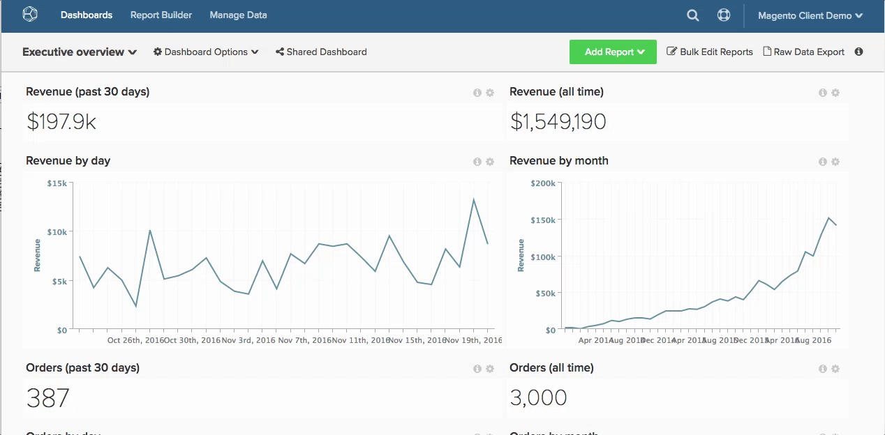
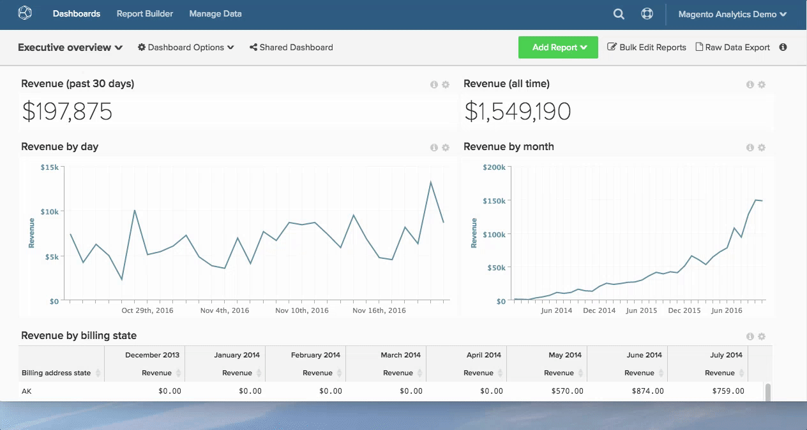

# 使用報表

在中使用報表 [!DNL Adobe Commerce Intelligence] 幫助您回答業務問題 — 無論您是希望查看本月與去年相比的收入，還是瞭解最新的購買成本 [!DNL Google AdWords] 競選。

從問題到答案的路到底是怎樣的？

為幫助您直觀地顯示此過程，將在下面映射該路由。 本主題介紹了您如何處理分析問題以及獲取所需資料所需的後端物流。

## 從問題開始

您知道，您不斷提出一些問題來改進業務，從提高客戶滿意度到降低供應成本。 您專注於如何將問題轉化為有助於您做出決策的分析。

在本示例中，假定您要回答以下問題：

* 我的新註冊者轉換的速度有多快？

## 識別度量

現在是時候確定一份可能的分析和測量清單，以幫助回答這個問題。 對於本示例，請關注以下度量：

* 每次使用從註冊到首次購買日期的平均時間。

這揭示了註冊日期和用戶第一個購買日期之間的平均時間，並提供了關於用戶在轉換漏斗中的最後一步如何操作的概念。

## 查找資料

瞭解該測量什麼只能讓我們獲得一部分。 要評估每個用戶從註冊到首次購買日期的平均時間，您需要確定度量包含的所有資料點。

將測量分解為核心元件。 您必須知道已註冊的人數、已購買人數以及這兩個事件之間經過的時間。

在更高級別，您需要知道在資料庫中查找此資料的位置，具體是：

* 每次註冊時記錄一行資料的表
* 記錄每次有人購買時的資料行的表
* 可用於連接或引用的列 `purchase` 的 `customer` 表 — 這樣我們就能知道誰購買了

在更精細的級別，您需要確定用於此分析的準確資料欄位：

* 包含客戶註冊日期的資料表和列：例如 `user.created\_at`
* 包含採購日期的資料表和列：例如 `order.created\_at`

## 建立資料列以進行分析

除了上面概述的本機資料列外，您還需要一組計算的資料欄位來啟用此分析，包括：

* `Customer's first purchase date` 返回特定用戶的 `MIN(order.created_at`)

然後用於建立：

* `Time between a customer's registration date and first purchase date`，它返回註冊到第一個購買日期之間某個特定用戶的時間。 這是以後指標的基礎。

這兩個欄位都需要在用戶級別上建立(例如，在 `user` )的正平方根。 這使平均分析能夠按用戶進行規範化（換句話說，此平均計算中的分母是用戶數）。

這裡 [!DNL Commerce Intelligence] 進去！ 你可以 [!DNL Commerce Intelligence] Data Warehouse，建立以上列。 與Adobe分析師團隊聯繫，並為我們提供新列的特定定義以供建立。 您還可以使用 [列編輯器](../../data-analyst/data-warehouse-mgr/creating-calculated-columns.md)。

最佳做法是避免直接在資料庫中建立這些計算的資料欄位，因為這會給生產伺服器帶來不必要的負擔。

## 建立度量

既然您擁有分析所需的資料欄位，現在是時候找到或建立相關度量來構建分析了。

在此，您要執行以下計算：

_[總和 `Time between a customer's registration date and first purchase date`] / [註冊和購買的客戶總數]_

您想看到這個計算，是根據客戶的註冊日期繪製的，或者趨勢。 下面是如何 [建立此度量](../../data-user/reports/ess-manage-data-metrics.md) 在 [!DNL Commerce Intelligence]:

1. 轉到 **[!UICONTROL Data]** 的 `Metrics` 頁籤。
1. 按一下 **[!UICONTROL Add New Metric]** 的 `user` 表格（在其中建立了上面的尺寸）。
1. 從下拉清單中，選擇 `Average` 的`Time between a customer's registration date and first purchase date` 列 `user` 按順序排列的表 `Customer's registration date`  的雙曲餘切值。
1. 添加任何相關篩選器或篩選器集。

此度量現已就緒。

## 建立報表

設定新度量後，您可以使用它按註冊日期報告註冊到第一個購買日期之間的平均時間。

只需轉到任何儀表板並 [建立報表](../../data-user/reports/ess-manage-data-metrics.md) 使用上面建立的度量。

### `Visual Report Builder` {#visualrb}

[的 `Visual Report Builder`](../../data-user/reports/ess-rpt-build-visual.md) 是可視化資料的最簡單方法。 如果您不熟悉SQL或想快速建立報告，則最好選擇「可視Report Builder」。 只需按一下幾下，即可添加度量、分段資料並建立整個組織的報告。 這一選擇對初學者和專家都是完美的，因為它不需要任何技術專長。

|  |  |
|--- |--- |
| **這對……** | **這對……** |
|  — 所有級別的分析/技術經驗  — 快速建立報告  — 建立分析以與其他用戶共用 |  — 需要SQL特定函式的分析  — 測試新列 — 計算列取決於初始資料填充的更新週期，而使用SQL建立的列則不是。 |

{style="table-layout:auto"}

### 報表說明和影像

#### 向報表添加說明

在建立與團隊其他成員共用的報告時，Adobe建議添加說明，以便其他用戶更好地瞭解您的分析。

1. 按一下 **[!UICONTROL i]** 在任何報告的頂部。
1. 在單詞框中輸入說明。
1. 按一下 **[!UICONTROL Save Description]**。

請參見以下內容：

#### 將報告導出為影像

是否需要在演示文稿或文檔中包含報告？ 任何報表都可以使用PNG、PDF或SVG格式保存為影像 `Report Options` 的子菜單。

1. 按一下任何報告右上角的齒輪表徵圖。
1. 從下拉清單中，選擇 `Enlarge`。
1. 放大報告時，按一下 **[!UICONTROL Download]** 在報告右上角。
1. 從下拉清單中選擇首選影像格式。 下載將立即開始。

請參見以下內容：

