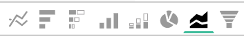
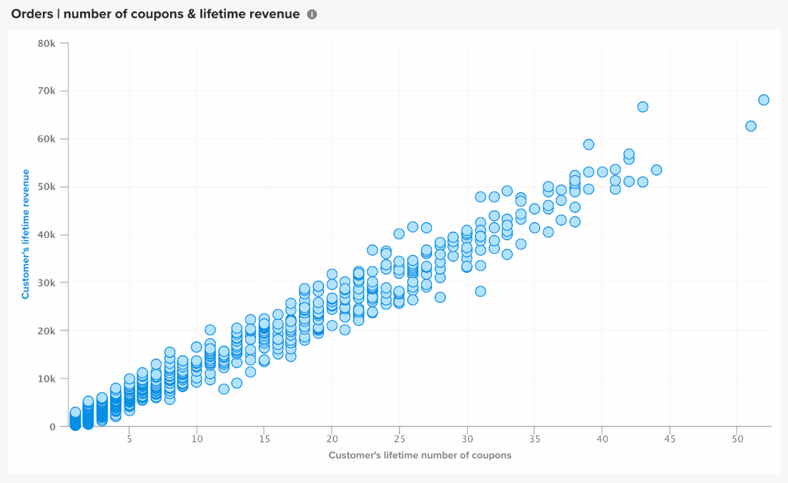

# 視覺效果選項

為特定資料集選取正確的視覺效果是分析流程的關鍵部分。 每個資料集都有一個故事可講，但該故事的效果通過其視覺影響和可讀性強調。

此 [!DNL Commerce Intelligence] [!DNL Visual Report Builder] 提供12種不同的視覺效果選項，各有其獨特的優勢和使用案例。 本主題討論中的各種視覺效果選項 [!DNL Commerce Intelligence]，包括必要的報表設定（如適用）和使用案例的範例。 下列視覺效果適用於 [!DNL Commerce Intelligence]：

* `Scalar`
* `Table`
* `Line`
* `Bar`
* `Stacked Bar`
* `Column`
* `Stacked Column`
* `Pie`
* `Area`
* `Funnel`
* `Scatter plot`
* `Bubble`
* `Heatmap`

## `Scalar`

`Scalar` 報表會顯示為單一數值。 這通常用於顯示關鍵量度（例如收入或訂單）的「所有時間」值，或是使用兩個獨立的純量報表來比較迄今的收入與預算。 在以下範例中，這只會顯示指定報告間隔的訂單總數：

若要將報表儲存為純量，請設定篩選器和時間設定，然後按一下 **[!UICONTROL Save]** 或 **[!UICONTROL Update]** 報表的右上角部分。 在 `Type` 在下拉式清單中，選擇「數字：量度名稱」 ，將報表儲存為左側邊欄中顯示的值。

**需求**：

* `Time interval`: `None`
* `Group by`: `None`
* 僅一個量度

## `Table`

顧名思義， `table` 報告非常適合顯示表格式詳細資訊。 當需要在單一報表中依值或量度顯示許多群組時，表格通常是最好的方式。 例如，下方的「客戶詳細資料」表格顯示依客戶電子郵件分組的訂單和收入：

與純量報表類似，您可以按一下「 」，將報表儲存為表格 **[!UICONTROL Save]** 或 **[!UICONTROL Update]** 在report builder中，選取「 」下方的「表格」選項 `Type` 下拉式清單。

**需求：**

* 雖然沒有報表組態需求，但請務必注意，表格限製為3500列。 如果您的資料集包含超過3500列，您需要篩選結果以縮小範圍，或匯出結果至 `.csv` 或 `Excel` 以檢視完整的資料集。

## `Line`

`Line` 圖表是比較類似量度同類群組績效的完美選擇。 例如，分析兩個區域在相同時段內的收入，或比較履行訂單年度與年度的成長率，如下所示：

新增至報表的每個量度和公式都會以自己的行表示。 比較具有類似單位和量度的量度時，別忘了清除的核取方塊 `Multiple Y-Axes` 以相同比例顯示所有量度。

若要將報表儲存為折線圖，請調整報表 `Type` 至 `Chart`，並從Report Builder中選取適當的視覺效果，如下所示：

**需求：**

* 無

## `Bar`

`Bar` 圖表會將您的資料顯示為一系列水準條，最適合顯示有限數量量度或按值分組的整體效能。 例如，長條圖可用來比較各商店的收入：

每個不同的量度、分組依據和時間間隔組合都會顯示為自己的長條圖。 如果您有兩個量度，但有一個 `group by`，包含三個相異專案 `group by` 值，您的報表會顯示六個個別的橫條。

若要將報表儲存為橫條圖，請調整報表 `Type` 至 `Chart` 並選取 `Bar` 選項，如下所示：

**需求：**

* 無

## `Stacked Bar`

`Stacked bar` 圖表與其長條圖兄弟類似，具有顯示每個長條按比例劃分的額外功能。 最常見的情況是，棧疊長條圖會以兩個或多個量度和單一群組依據來設定，因此每個長條都會代表依值劃分的唯一群組，而這些值會分割成不同的量度元件。

例如，下列報表有兩個相同的收入量度，其中一個是第一次篩選的訂單，另一個是篩選重複的訂單。 依商店分組後，您可以看到每個商店的總收入貢獻（以橫條的總寬度表示），以及每個商店的第一次與重複收入劃分。

確定 `Multiple Y-Axes` 方塊會在設定如上所述的報表時取消勾選。

若要將報表儲存為棧疊長條圖，請調整報表 `Type` 至 `Chart` 並從report builder中選取「棧疊長條圖」選項：

**需求：**

* 無

## `Column`

`Column` 圖表會將每個資料點顯示為垂直欄，且較之水準長條圖視覺效果，圖表更適合顯示時間趨勢資料。 每個唯一的量度和組合群組都會以各自的一系列長條表示。 欄報表最適合含有三個或三個以下的量度，或一個量度含有單一群組（依值分組）的報表。

在以下範例中，您會看到兩個收入量度，一個是篩選第一次收入，另一個是篩選重複收入，依月在一段時間內的趨勢：

欄報告可透過變更報告進行儲存 `Type` 至 `Chart`，並選取欄視覺效果選項：

**需求：**

* 無

## `Stacked Column`

`Stacked column` 報表與直條圖幾乎完全相同，不同之處在於相似的欄會棧疊在彼此頂端，因此總高度會代表值的總和。 棧疊欄可再次透過有限數量的量度或群組欄目獲得最佳視覺效果。

使用「 」中所述的相同報表設定 `Column` 區段上方，含有兩個收入量度（首次篩選和重複）的報表會以棧疊欄視覺效果呈現以下畫面：

同樣重要的是 `Multiple Y-Axes` 使用棧疊欄視覺效果顯示多個量度時，核取方塊會清除。

若要將報表儲存為棧疊欄，請設定報表 `Type` 至 `Chart` 並選取 `stacked column` 選項：

**需求：**

* 無

## `Pie`

`Pie` 圖表最適合顯示具有一個或多個群組框的單一量度，或沒有群組框的多個量度。 不論是哪種情況，時間間隔都必須設定為none，才能在圓形圖中顯示資料。 在以下範例中，單一訂單量度是依商店名稱分組，以顯示依商店的訂單劃分：

若要將報表儲存為圓形圖，請設定報表 `Type` 至 `Chart` 並選取 `pie` 選項，如下所示：

**需求：**

* `Time interval`: `None`
* 下列其中一項：
   * `Single metric with one or more group bys`
   * `Multiple metrics with no group bys`

## `Area`

`Area` 除了欄連續顯示外，圖表幾乎與棧疊直條圖相同。 區域圖與棧疊欄類似，最能用有限的群組框或量度來視覺化。

以來自的相同範例為例 `stacked column` 區段，以下報表會以區域圖視覺效果顯示首次與重複收入：

若要將報表另存為區域圖，請調整 `Type` 至 `Chart` 並選取區域選項：

**需求：**

* 無

## `Funnel`

`Funnel` 圖表非常適合用於以視覺效果呈現預期事件序列中的轉換。 一些範例包括分析銷售漏斗中從銷售線索到成交交易的潛在收入，或衡量客戶在第一筆和第二筆訂單、第二筆和第三筆訂單之間的下降幅度，等等。 後者的範例顯示如下：

在漏斗報表中，漏斗的指定步驟的相對值會由步驟的高度反映。 報表設定會決定步驟的顯示順序。 有兩種方法可設定漏斗報表：

* `Single metric with one group by`： — 由群組依據的「顯示頂端/底部」設定決定的步驟順序。 依預設，漏斗步驟會依最大到最小值的順序顯示，但您也可以依名稱的群組依字母順序排序。

* `Multiple metrics with no group by`： — 步驟順序，由量度新增至報表的順序決定。

若要將報表儲存為漏斗圖，請調整報表 `Type` 至 `Chart` 並從report builder中選取適當的視覺效果。

**需求：**

* `Time interval`: `None`
* 下列其中一項：
   * `Single metric with one group by`
   * `Multiple metrics with no group by`

## `Scatter plot`

A `scatter plot` 用於檢查量度與兩個不同變數的關係，以便輕鬆識別關聯和離群值。 此型別的視覺效果最適合搭配數值維度使用 — 請嘗試搭配訂購量度和 `Customer's lifetime number of coupons` 和 `Customer's lifetime revenue` 維度以瞭解優惠券使用與收入的關係。 您可以選擇有趨勢線還是沒有趨勢線的散佈圖：

**需求：**

選項1：

* 二 `metrics`
* 一 `group by`
* `Time interval`: `None`

選項2：

* 二 `metrics`
* 否 `group by`
* 設定 `time interval`

## `Bubble` 圖表

A `bubble` 圖表最多可顯示四個資料維度，其中 `X` 和 `Y` 軸指定泡泡的位置。 此 `Z` axis是泡泡的大小，包含兩個群組泡泡後，您就可以新增顏色到泡泡。 如果您想要在單一圖表中繪製多個維度的資料，最好使用此型別的視覺效果。

例如，下列圖表顯示依特定贏取來源（泡泡顏色）和狀態（特定顏色的各種泡泡）分組的客戶數量（泡泡大小），並根據總收入和平均期限訂單繪圖。

下圖顯示依贏取來源（泡泡顏色）和狀態（特定顏色的各種泡泡）分組的客戶數量（泡泡大小），是根據平均存留期值和總收入繪圖。

**單一序列泡泡圖的要求：**

選項1

* 三 `metrics`
* 一 `group by`
* `Time interval`: `None`

選項2

* 三 `metrics`
* 否 `group by`
* 設定 `time interval`

**多序列泡泡圖的要求：**

* 三 `metrics`
* 二 `group by`
* `Time interval`: `None`

## `Heatmap`

使用 `heatmaps` 以視覺化呈現資料中的熱點。 例如，熱度圖可指出您通常在哪裡獲得較高的熱度。 將這些資料視覺化，可協助您調整存貨層次，以確保您在尖峰時段符合需求。

下列熱度圖會以彙總方式顯示數週內，依一週中某天某小時的訂單。

<!--{: width="650"}-->

**需求：**

選項1

* 一 `metric`
* 二 `group by`
* `Time interval`: `None`

選項2

* 一 `metric`
* 一 `group by`
* 設定 `time interval`
