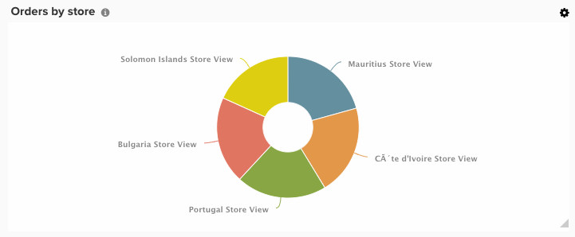
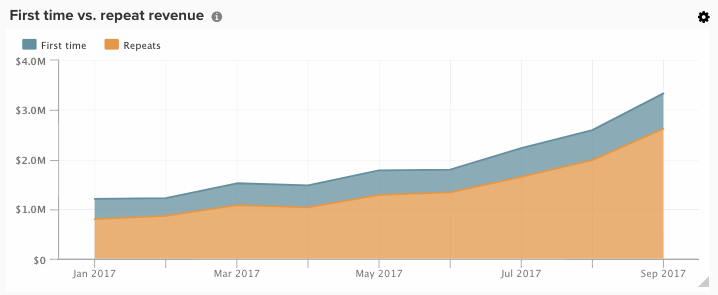

# 視覺效果選項

為特定資料集選取正確的視覺效果是分析流程的關鍵部分。 每個資料集都有要講述的故事，但該故事的效果會透過其視覺影響和可讀性來強調。

[!DNL Commerce Intelligence] [!DNL Visual Report Builder]提供12個不同的視覺效果選項，每個選項都有各自的優勢和使用案例。 本主題討論[!DNL Commerce Intelligence]中的各種視覺效果選項，包括適用的必要報表設定和使用案例範例。 [!DNL Commerce Intelligence]中有下列視覺效果：

* `Scalar`
* `Table`
* `Line`
* `Bar`
* `Stacked Bar`
* `Column`
* `Stacked Column`
* `Pie`
* `Area`
* `Funnel`
* `Scatter plot`
* `Bubble`
* `Heatmap`

## `Scalar`

`Scalar`個報告會顯示為單一數值。 這通常用於顯示關鍵量度（例如收入或訂單）的「所有時間」值，或用來比較具有兩個單獨純量報表的收入累計與預算。 在以下範例中，只會顯示指定報告間隔的訂單總數：

若要將報表儲存為純量，請設定篩選器和時間設定，然後按一下報表右上角的&#x200B;**[!UICONTROL Save]**&#x200B;或&#x200B;**[!UICONTROL Update]**。 在`Type`下拉式清單中，選擇「數字：量度名稱」 ，將報表儲存為左側邊欄中顯示的值。

**需求**：

* `Time interval`： `None`
* `Group by`： `None`
* 僅一個量度

## `Table`

顧名思義，`table`個報告非常適合用於顯示表格式詳細資訊。 當需要在單一報告中依值或量度顯示許多群組時，表格通常是最好的方式。 例如，「客戶詳細資料」表格底下顯示依客戶電子郵件分組的訂單和收入：

與純量報表類似，您可以在Report Builder中按一下&#x200B;**[!UICONTROL Save]**&#x200B;或&#x200B;**[!UICONTROL Update]**，然後選取`Type`下拉式清單下的「表格」選項，將報表儲存為表格。

**需求：**

* 雖然沒有報表組態需求，但請務必注意，表格限製為3500列。 如果您的資料集包含超過3500列，您需要篩選結果以縮小範圍，或將結果匯出至`.csv`或`Excel`以檢視完整的資料集。

## `Line`

`Line`圖表是比較類似量度同類群組效能的完美選擇。 例如，分析兩個區域在相同時段內的收入，或比較履行訂單中年與年的成長率，如下所示：

新增到報表的每個量度和公式都會以自己的行表示。 比較具有類似單位和比例的量度時，別忘了清除`Multiple Y-Axes`的核取方塊，以相同比例顯示所有量度。

若要將報表儲存為折線圖，請將報表`Type`調整為`Chart`，然後從Report Builder中選取適當的視覺效果，如下所示：

**需求：**

* 無

## `Bar`

`Bar`圖表將您的資料顯示為一系列水準條，最適合顯示有限量度或按值群組的整體效能。 例如，長條圖可用來比較各商店的收入：

每個不同的量度、分組依據和時間間隔組合都會顯示為其本身的長條圖。 如果您有兩個量度，其中有一個`group by`，包含三個不同的`group by`值，則您的報表會顯示六個個別的橫條。

若要將報告儲存為長條圖，請將報告`Type`調整為`Chart`並選取`Bar`選項，如下所示：

**需求：**

* 無

## `Stacked Bar`

`Stacked bar`個圖表與其長條圖兄弟類似，額外可顯示每個長條圖的成比例劃分。 棧疊長條圖通常使用兩個或多個量度和單一群組依據來設定，因此每個長條表示分散在量度組成部份中的唯一群組依據值。

例如，以下報表有兩個相同的收入量度，其中一個是初次篩選訂單，另一個是篩選重複訂單。 依商店分組後，您可以看到每個商店的總收入貢獻（由橫條的總寬度表示），以及每個商店的第一次與重複收入劃分。

設定如上所述的報告時，請確定未勾選`Multiple Y-Axes`方塊。

若要將報表儲存為棧疊長條圖，請將報表`Type`調整為`Chart`，然後從Report Builder中選取棧疊長條圖選項：

**需求：**

* 無

## `Column`

`Column`圖表將每個資料點顯示為垂直欄，且比水準長條圖視覺效果更適合顯示時間趨勢資料。 每個獨特的量度和組合群組都會以各自的一系列長條圖呈現。 欄報表最適合含有三個或更少量度，或一個量度含有單一群組的報表，其方式是包含1-3個群組依據值。

在下列範例中，您會看到兩個收入量度，一個是篩選第一次收入，另一個是篩選重複收入，依月在一段時間內的趨勢：

將報表`Type`變更為`Chart`，並選取欄視覺效果選項，即可儲存欄報表：

**需求：**

* 無

## `Stacked Column`

`Stacked column`個報表幾乎與直條圖相同，不同之處在於類似的直條圖彼此棧疊在一起，因此總高度代表值的總和。 棧疊欄可再次透過有限數量的量度或群組欄最佳視覺化。

使用上述`Column`區段中所述的相同報表設定，具有兩個收入量度（首次篩選並重複）的報表看起來類似以下具有棧疊欄視覺效果的報表：

同樣重要的是，使用棧疊欄視覺效果顯示多個量度時，`Multiple Y-Axes`核取方塊必須清除。

若要將報表儲存為棧疊欄，請將報表`Type`設定為`Chart`並選取`stacked column`選項：

**需求：**

* 無

## `Pie`

`Pie`圖表最適合顯示具有一個或多個群組框的單一量度，或沒有群組框的多個量度。 不論使用何種方法，時間間隔都必須設為none，才能在圓餅圖中顯示資料。 在以下範例中，單一訂單量度是依商店名稱分組，以顯示依商店的訂單劃分：

若要將報告儲存為圓餅圖，請將報告`Type`設定為`Chart`並選取`pie`選項，如下所示：

**需求：**

* `Time interval`： `None`
* 下列其中一項：
   * `Single metric with one or more group bys`
   * `Multiple metrics with no group bys`

## `Area`

`Area`個圖表幾乎與棧疊直條圖相同，只是直條圖會持續顯示。 區域圖與棧疊欄類似，是透過有限數目的群組框或量度呈現最佳視覺效果。

以`stacked column`區段的相同範例為例，以下報表以區域圖視覺效果顯示首次與重複收入：

若要將報表儲存為區域圖，請將`Type`調整為`Chart`並選取區域選項：

**需求：**

* 無

## `Funnel`

`Funnel`個圖表可完美地以視覺效果呈現預期事件順序的轉換。 幾個範例包括分析銷售漏斗中從銷售線索到成交的潛在收入，或衡量客戶在第一與第二筆訂單、第二筆與第三筆訂單之間的減少量，依此類推。 後者的範例顯示如下：

在漏斗報表中，漏斗的指定步驟的相對值會以步驟的高度反映出來。 報表組態會決定步驟的顯示順序。 設定漏斗報表的方式有兩種：

* `Single metric with one group by`： — 由群組依據的「顯示頂端/底部」設定所決定的步驟順序。 依預設，漏斗步驟會依最大到最小值的順序顯示，但您也可以依名稱的群組按字母順序排序。

* `Multiple metrics with no group by`： — 步驟的順序，由量度新增至報表的順序決定。

若要將報表儲存為漏斗圖，請將報表`Type`調整為`Chart`並從Report Builder中選取適當的視覺效果。

**需求：**

* `Time interval`： `None`
* 下列其中一項：
   * `Single metric with one group by`
   * `Multiple metrics with no group by`

## `Scatter plot`

`scatter plot`用於檢查量度與兩個不同變數的關係，以便您輕鬆識別關聯和離群值。 此型別的視覺效果最好僅搭配數值維度使用 — 請搭配訂購量度以及`Customer's lifetime number of coupons`和`Customer's lifetime revenue`維度試用，以檢視優惠券使用與收入的相關性。 您可以選擇使用或不使用趨勢線的散佈圖：

**需求：**

選項1：

* 兩個`metrics`
* 一個`group by`
* `Time interval`： `None`

選項2：

* 兩個`metrics`
* 無`group by`
* 設定`time interval`

## `Bubble`圖表

`bubble`圖表最多可顯示4個資料維度，`X`和`Y`軸會指定泡泡的位置。 `Z`軸是泡泡的大小，只要加入兩個群組，您就可以將顏色加入泡泡中。 如果您想要在單一圖表中繪製多個資料維度，最好使用此型別的視覺效果。

例如，下列圖表顯示依特定贏取來源（泡泡顏色）和狀態（特定顏色的各種泡泡）分組的客戶數量（泡泡大小），並依據總收入和平均期限訂單繪圖。

下圖顯示依贏取來源（泡泡顏色）和狀態（特定顏色的各種泡泡）分組的客戶數量（泡泡大小），並依據平均期限值和總收入繪圖。

**單一數列泡泡圖的要求：**

選項1

* 三個`metrics`
* 一個`group by`
* `Time interval`： `None`

選項2

* 三個`metrics`
* 無`group by`
* 設定`time interval`

**多序列泡泡圖的要求：**

* 三個`metrics`
* 兩個`group by`
* `Time interval`： `None`

## `Heatmap`

使用`heatmaps`視覺化資料中的熱點。 例如，熱度圖可指出您通常在哪裡獲得較高的流量。 以視覺效果呈現這些資料，可協助您調整存貨層次，以確保滿足高峰期的需求。

下列熱度圖會以彙總方式顯示數週內，按一週中的某天或按某小時排列的訂單。

<!--{: width="650"}-->

**需求：**

選項1

* 一個`metric`
* 兩個`group by`
* `Time interval`： `None`

選項2

* 一個`metric`
* 一個`group by`
* 設定`time interval`
