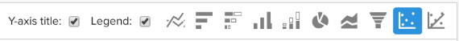

# 可視化選項

為給定資料集選擇正確的可視化是分析過程的關鍵部分。 每個資料集都有一個故事要講述，但故事的效果強調於它的視覺效果和可讀性。

的 [!DNL Commerce Intelligence] [!DNL Visual Report Builder] 提供了12個不同的可視化選項，每個選項都具有各自的優勢和使用案例。 本主題討論中的各種可視化選項 [!DNL Commerce Intelligence]，包括所需的報告配置（如果適用），以及使用案例示例。 以下可視化在 [!DNL Commerce Intelligence]:

* `Scalar`
* `Table`
* `Line`
* `Bar`
* `Stacked Bar`
* `Column`
* `Stacked Column`
* `Pie`
* `Area`
* `Funnel`
* `Scatter plot`
* `Bubble`
* `Heatmap`

## `Scalar`

`Scalar` 報告顯示為單個數字值。 這通常用於顯示關鍵指標（如收入或訂單）的「全時」值，或使用兩個單獨的標量報表比較收入至今與預算。 在下例中，它只顯示給定報告間隔的訂單總數：

要將報告另存為標量，請配置篩選器和時間設定，然後按一下 **[!UICONTROL Save]** 或 **[!UICONTROL Update]** 右上角。 在 `Type` 下拉清單，選擇「Number：（編號：）」將報表另存為左側欄上顯示的值的度量名稱。

**要求**:

* `Time interval`: `None`
* `Group by`: `None`
* 僅一個度量

## `Table`

按照名字， `table` 報告非常適合顯示表格詳細資訊。 當需要在單個報告中按值或度量顯示許多組時，表通常是最佳的選擇。 例如，下面是「客戶詳細資訊」表，其中顯示按客戶電子郵件分組的訂單和收入：

與標量報告類似，您可以通過按一下 **[!UICONTROL Save]** 或 **[!UICONTROL Update]** 在報表生成器中，然後選擇 `Type` 下拉清單。

**要求：**

* 儘管沒有報告配置要求，但必須注意的是，表的數量限制在3500行。 如果資料集包含3500多行，則需要篩選結果以縮小範圍，或將結果導出到 `.csv` 或 `Excel` 查看完整的資料集。

## `Line`

`Line` 圖表是比較相似度量系數效能的最佳選擇。 例如，分析同一時間期內兩個地區的收入，或比較已履行訂單的年度增長，如下所示：

添加到報表的每個度量和公式都由其自己的行表示。 將度量與相似的單位和規模進行比較時，不要忘記清除 `Multiple Y-Axes` 顯示相同比例的所有度量。

要將報表另存為折線圖，請調整報表 `Type` 至 `Chart`，然後從報表生成器中選擇相應的可視化，如下所示：

**要求：**

* 無

## `Bar`

`Bar` 圖表將資料顯示為一系列水準條，最適合顯示有限數量的度量或按值分組的整體效能。 例如，可以使用條形圖按商店比較收入：

每個不同度量、分組依據和時間間隔組合都顯示為其自己的條。 如果有兩個度量和一個 `group by`包含三個不同 `group by` 值，您的報表顯示六個單獨的條。

要將報表另存為條形圖，請調整報表 `Type` 至 `Chart` 的 `Bar` 選項：

**要求：**

* 無

## `Stacked Bar`

`Stacked bar` 圖表與條形圖的同類圖相似，還具有顯示每個條形的比例細分的附加功能。 最常見的是，堆疊條形圖使用兩個或多個度量和單個分組依據設定，使得每個條形表示一個在其度量構成部分之間拆分的唯一分組依據值。

例如，下面的報表有兩個相同的收入指標，其中一個用於首次篩選訂單，另一個用於重複訂單。 按商店分組後，您可以看到每個商店的總收入貢獻（由欄的總寬度表示）和每個商店的首次與重複收入細分。

確保 `Multiple Y-Axes` 框。

要將報表另存為堆積條形圖，請調整報表 `Type` 至 `Chart` 並從報表生成器中選擇堆疊條選項：

**要求：**

* 無

## `Column`

`Column` 圖表將每個資料點表示為垂直列，與水準條形圖可視化相比，圖表更適合顯示時間趨勢資料。 每個唯一度量和組合組都以其自己的一系列條來表示。 列報告最適用於包含1-3組按值的具有三個或更少度量或具有單個組的一個度量的報告。

在下面的示例中，您看到兩個收入指標，一個篩選為首次收入，另一個篩選為重複收入，並逐個逐個趨勢分析：

可通過更改報表來保存列報表 `Type` 至 `Chart`，然後選擇列可視化選項：

**要求：**

* 無

## `Stacked Column`

`Stacked column` 報告幾乎與柱形圖相同，但相似的列相互疊加，以使總高度表示值之和。 堆疊列再次最好使用有限數量的度量或組by進行可視化。

使用與 `Column` 上面部分，包含兩個收入指標（首次篩選並重複）的報告與下面的堆積列可視化報告類似：

同樣，重要的是 `Multiple Y-Axes` 當使用堆積列可視化顯示多個度量時，將清除複選框。

要將報表另存為堆積列，請設定報表 `Type` 至 `Chart` 的 `stacked column` 選項：

**要求：**

* 無

## `Pie`

`Pie` 圖表最適合顯示具有一個或多個組by的單個度量或無組by的多個度量。 在這兩種情況下，必須將時間間隔設定為無才能在餅圖中顯示資料。 在以下示例中，單個訂單度量按儲存名分組，以顯示按儲存的訂單細分：

要將報表另存為餅圖，請設定報表 `Type` 至 `Chart` 的 `pie` 選項：

**要求：**

* `Time interval`: `None`
* 以下任一項：
   * `Single metric with one or more group bys`
   * `Multiple metrics with no group bys`

## `Area`

`Area` 圖表與堆積柱形圖幾乎相同，只是列會連續顯示。 與堆疊的列類似，面積圖最好使用有限數量的組by或度量進行可視化。

從 `stacked column` 圖顯示下面的「首次與重複收入」部分：

要將報表另存為區域圖，請調整 `Type` 至 `Chart` 並選擇區域選項：

**要求：**

* 無

## `Funnel`

`Funnel` 圖表非常適合在預期的事件序列中可視化轉換。 幾個示例包括分析銷售渠道中從銷售線索到完成交易的潛在收入，或衡量客戶在第一份和第二份訂單、第二份和第三份訂單之間的降幅，等等。 後者的示例如下所示：

在漏斗報告中，漏斗的給定步驟的相對值由步驟的高度反映。 報告配置確定步驟的顯示順序。 配置漏斗報告有兩種方法：

* `Single metric with one group by`: — 由組的「顯示頂部/底部」設定確定的步驟順序。 預設情況下，漏斗步驟按從最大值到最小值的順序顯示，但您也可以按名稱的字母順序對它們進行排序。

* `Multiple metrics with no group by`: — 由度量添加到報表的順序確定的步驟順序。

要將報表另存為漏斗圖，請調整報表 `Type` 至 `Chart` 並從報表生成器中選擇相應的可視化。

**要求：**

* `Time interval`: `None`
* 以下任一項：
   * `Single metric with one group by`
   * `Multiple metrics with no group by`

## `Scatter plot`

A `scatter plot` 用於檢查度量與兩個不同變數的關係，以便可以輕鬆識別關聯和異常值。 此類型的可視化效果最好僅用於數字維 — 請使用「訂單」度量和 `Customer's lifetime number of coupons` 和 `Customer's lifetime revenue` 維，查看優惠券使用與收入的關係。 可以在具有或不具有趨勢線的散點圖之間進行選擇：

**要求：**

選項1:

* 二 `metrics`
* 一 `group by`
* `Time interval`: `None`

選項2:

* 二 `metrics`
* 否 `group by`
* 設定 `time interval`

## `Bubble` 圖表

A `bubble` 圖表最多可顯示四維資料，其中 `X` 和 `Y` 軸指定氣泡的位置。 的 `Z` axis是氣泡的大小，通過包括兩個組，您可以向氣泡添加顏色。 當您想在單個圖表中繪製多個維的資料時，最好使用此類型的可視化。

例如，下圖顯示按特定獲取源（氣泡顏色）和狀態（特定顏色的各種氣泡）分組的客戶數（氣泡大小），根據總收入和平均生存期訂單繪製。

下圖顯示按獲取源（氣泡顏色）和狀態（特定顏色的各種氣泡）分組的客戶數（氣泡大小），根據平均生存期值和總收入繪製。

**單系列氣泡圖要求：**

選項1

* 三 `metrics`
* 一 `group by`
* `Time interval`: `None`

選項2

* 三 `metrics`
* 否 `group by`
* 設定 `time interval`

**多系列氣泡圖要求：**

* 三 `metrics`
* 二 `group by`
* `Time interval`: `None`

## `Heatmap`

使用 `heatmaps` 以可視化資料中的熱點。 例如，熱度圖可以指示您經常從何處獲得更大容量。 可視化此資料可幫助您調整庫存水準，以確保在這些高峰時段滿足需求。

下面的熱圖顯示按星期的訂單，按每天的小時合計，在幾週內。

<!--{: width="650"}-->

**要求：**

選項1

* 一 `metric`
* 二 `group by`
* `Time interval`: `None`

選項2

* 一 `metric`
* 一 `group by`
* 設定 `time interval`
