# 啟動您的 [!DNL MBI] 帳戶 `Cloud Starter` 訂閱

啟用 [!DNL MBI] for `Cloud Starter` 專案，首先建立 [!DNL MBI] 帳戶，然後建立 `SSH` 鍵，然後最後連線至您的商務資料庫。 請參閱 [啟用內部部署訂閱](../getting-started/onpremise-activation.md).

>[!NOTE]
>
>如需啟動的協助 [!DNL MBI] for `Cloud Pro` 項目，請聯繫您的Adobe客戶團隊或客戶技術顧問。

1. 建立 [!DNL MBI] 帳戶。

   - 前往 [Adobe Commerce帳戶登入](https://account.magento.com/customer/account/login)

   - 前往 **[!UICONTROL My Account** > **My [!DNL MBI] Instances]**.

   - 按一下 **[!UICONTROL Create Instance]**. 如果您沒有看到此按鈕，請聯繫您的Adobe客戶團隊或客戶技術顧問。

   - 選取 `Cloud Starter` 訂閱。 如果您只有 `cloud starter` 訂閱，此為預設選項。

   - 按一下 **[!UICONTROL Continue]**.

   - 輸入您的資訊以建立帳戶。

   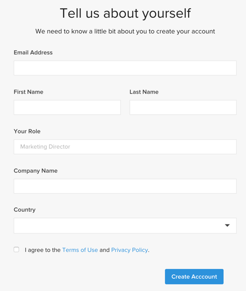

   - 前往收件匣並驗證您的電子郵件地址。

   

   - 建立密碼。

   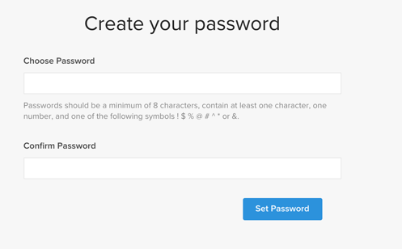

   - 建立帳戶後，您可以將使用者新增至新帳戶。 現在可以新增技術管理員以執行下列步驟。

   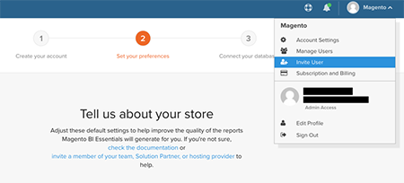

1. 輸入有關儲存的資訊以設定您的偏好設定。

   

   先收集一些資訊，然後才能連接資料庫以執行入門流程的第三步。 您完成 `Connect your database` 頁面。

1. 建立專用 [!DNL MBI] 使用者。

   - 在 [Adobe Commerce帳戶](https://account.magento.com/customer/account/login).

   - _為什麼是新使用者？_ [!DNL MBI] 需要新增至專案的使用者持續擷取要傳輸至帳戶的新資料 [!DNL MBI] Data Warehouse。 此使用者可作為該連線。 步驟4將介紹如何將此用戶添加到項目。

   - 擁有專屬 [!DNL MBI] 使用者可防止新增的使用者因疏忽而停用或刪除，並停止 [!DNL MBI] 連線。

1. 將新建立的使用者新增至專案的主要環境，作為 `Contributor`.

   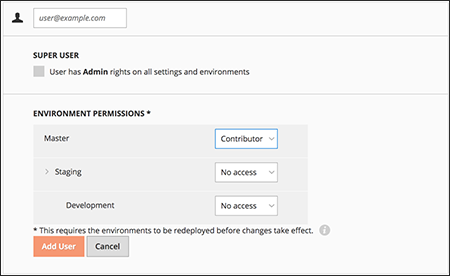

1. 取得您的 [!DNL MBI] `SSH` 鍵。

   - 前往 `Connect your database` 頁面 [!DNL MBI] 設定使用者介面，向下捲動至 `Encryption settings`.

   - 若 `Encryption Type` 欄位，選擇 `SSH Tunnel`.

   - 從下拉式清單中，您可以複製並貼上提供的 [!DNL MBI] `Public Key`.

   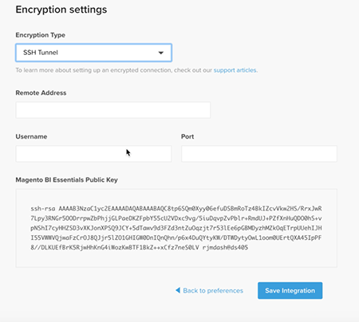

1. 新增 [!DNL MBI] `Public key` 到 [!DNL MBI] 在步驟5中建立的使用者。

   - 前往 [您的雲端Adobe Commerce帳戶](https://account.magento.com/cloud/customer/login/). 使用您的帳戶登入資訊登入新 [!DNL MBI] 用戶已建立。 然後前往 `Account Settings` 標籤。

   - 向下捲動頁面，然後展開下拉式清單 `SSH` 鍵。 然後按一下 **[!UICONTROL Add a public key]**.

   

   - 新增 [!DNL MBI] `SSH Public Key` 從上方。

   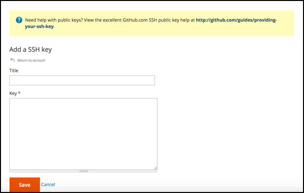

1. 提供 [!DNL MBI] MySQL憑據。

   - 更新您的 `.magento/services.yaml`

   ```sql
   mysql:
       type: mysql:10.0
       disk: 2048
       configuration:
           schemas:
               - main
           endpoints:
               mysql:
                   default_schema: main
                   privileges:
                       main: admin
               mbi:
                   default_schema: main
                   privileges:
                       main: ro
   ```

   - 更新您的 `.magento.app.yaml`

   ```sql
           relationships:
               database: "mysql:mysql"
               mbi: "mysql:mbi"
               redis: "redis:redis"
   ```

1. 獲取將資料庫連接到 [!DNL MBI].

   執行
   `echo $MAGENTO_CLOUD_RELATIONSHIPS | base64 --decode | json_pp`

   獲取有關連接資料庫的資訊。

   您應會收到類似以下輸出的資訊：

   ```json
           "mbi" : [
                 {
                    "scheme" : "mysql",
                    "rel" : "mbi",
                    "cluster" : "vfbfui4vmfez6-master-7rqtwti",
                    "query" : {
                       "is_master" : true
                    },
                    "ip" : "169.254.169.143",
                    "path" : "main",
                    "host" : "[!DNL MBI].internal",
                    "hostname" : "3m7xizydbomhnulyglx2ku4wpq.mysql.service._.magentosite.cloud",
                    "username" : "mbi",
                    "service" : "mysql",
                    "port" : 3306,
                    "password" : "[password]"
                 }
              ],
   ```

1. 連接您的商務資料庫

   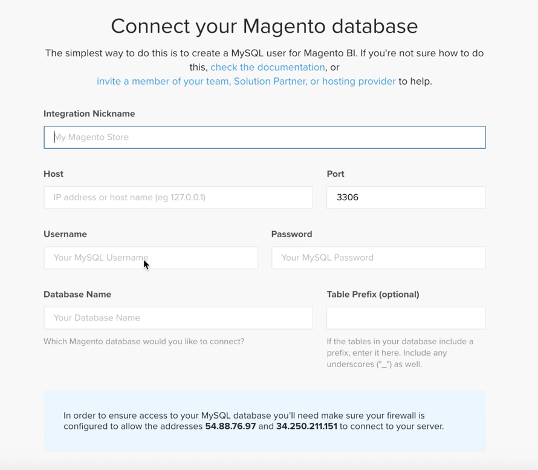

   - `Integration Name`: [選擇整合的名稱。]

   - `Host`: `[!DNL MBI].internal`

   - `Port`: `3306`

   - `Username`: `mbi`

   - `Password`: [在步驟8的輸出中提供輸入密碼。]

   - `Database Name`: `main`

   - `Table Prefixes`: [如果沒有表前置詞，則保留為空]

1. 設定您的時區設定。

   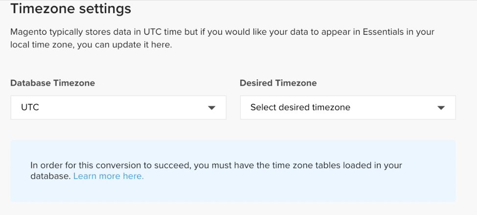

   - `Database`: `Timezone: UTC`

   - `Desired Timezone`: [選擇要顯示資料的時區。]

1. 獲取加密設定的資訊。

   - 專案UI提供 `SSH` 存取字串。 此字串可用來收集 `Remote Address` 和 `Username` 在 `Encryption` 設定。 使用 `SSH Access` 字串，方法是按一下專案UI主要分支上的存取網站按鈕，然後找到您的 `User Name` 和 `Remote Address` 如下所示。

   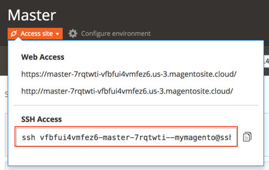

   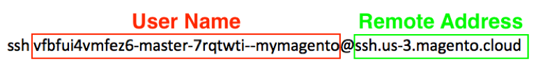

1. 輸入資訊 `Encryption` 設定

   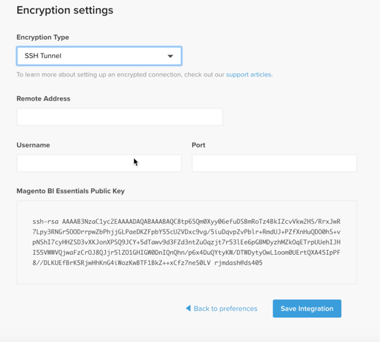

   **輸入**

   - `Encryption Type`: `SSH Tunnel`

   - `Remote Address`: `ssh.us-3.magento.cloud`

   - `Username`: `vfbfui4vmfez6-master-7rqtwti--mymagento`

   - `Port`: `22`

1. 按一下 **[!UICONTROL Save Integration]**.

1. 您現在已成功連線至 [!DNL MBI] 帳戶。

1. 成功連接後 [!DNL MBI] 至您的商務資料庫，請連絡您的Adobe帳戶團隊以協調後續步驟，例如設定整合和其他設定步驟。

1. 完成配置後，您可以 [登入](../getting-started/sign-in.md) 至 [!DNL MBI] 帳戶。
