# 啟用您的[!DNL Commerce Intelligence]帳戶以進行內部部署和入門訂閱

若要針對內部部署訂閱啟用[!DNL Commerce Intelligence]，請先建立[!DNL Commerce Intelligence]帳戶、輸入您的設定資訊，然後將[!DNL Commerce Intelligence]連線至您的[!DNL Commerce]資料庫。<!-- For information about activation in `Cloud Starter` projects, see [Activating your [!DNL Commerce Intelligence] Account for `Cloud Starter` Subscriptions](../getting-started/cloud-activation.md).-->

## 建立您的[!DNL Commerce Intelligence]帳戶

若要建立您的帳戶，請聯絡您的Adobe帳戶團隊或客戶技術顧問。

## 建立您的密碼

建立帳戶之後，請檢視電子郵件中是否有來自[!DNL The Magento BI Team@rjmetrics.com]的帳戶通知電子郵件。 使用電子郵件中提供的連結來存取您的[!DNL Commerce Intelligence]帳戶並建立密碼。 移至您的收件匣並驗證您的電子郵件地址。

如果您沒有收到電子郵件，[請連絡支援](https://experienceleague.adobe.com/docs/commerce-knowledge-base/kb/troubleshooting/miscellaneous/mbi-service-policies.html?lang=en)。

## 設定您的商店偏好設定

在設定資料庫連線之前，請先完成存放區資訊表單。 需要此資訊才能完成&#x200B;**[!UICONTROL Connect your Database]**&#x200B;安裝。

## 新增[!DNL Commerce Intelligence]位使用者

在您設定密碼並登入[!DNL Commerce Intelligence]之後，您可以將其他使用者新增到您的[!DNL Commerce Intelligence]帳戶。 新增使用者時，請新增具有適當許可權的管理員使用者以完成啟用程式。

## 在[!DNL Commerce Intelligence]管理員中建立專用的[!DNL Commerce]使用者

若要使用[!DNL Commerce Intelligence]，您必須將永久且專屬的使用者新增至[!DNL Commerce]專案。 此專屬使用者可做為與[!DNL Commerce]的永久連線，以啟用擷取新資料並將新資料傳輸至帳戶的[!DNL Commerce Intelligence] Data Warehouse。

設定專用的[!DNL Commerce Intelligence]使用者可確保不會停用或刪除該帳戶，進而停止[!DNL Commerce Intelligence]連線。

>[!NOTE]
>
>Adobe鼓勵使用可指出其永久狀態的帳戶名稱（例如ACI專用、ACI資料庫聯結器等）。

在您於Admin中建立[!DNL Commerce Intelligence]的專用使用者後，請以[!DNL Commerce]設定為&#x200B;**[!UICONTROL Master]**&#x200B;將相同使用者新增到`Contributor`專案的主要環境。

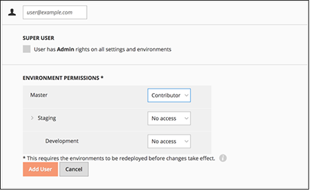

## 取得Commerce Intelligence SSH金鑰

1. 在[!UICONTROL Connect your database]設定的[!DNL Commerce Intelligence]頁面上，向下捲動並選取&#x200B;**[!UICONTROL Encryption settings]**。

1. 對於&#x200B;**加密型別**，請選取`SSH Tunnel`。

1. 從下拉式清單，複製提供的公開金鑰。

   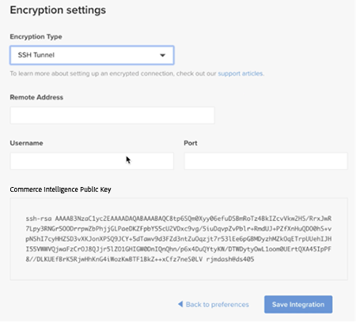

## 將您的公開金鑰新增至[!DNL Commerce Intelligence]

1. 從[!DNL Commerce Admin]，使用您剛建立之[!DNL Commerce Intelligence]使用者的登入資訊登入。

1. 選取「**帳戶設定**」標籤。

1. 向下捲動並展開&#x200B;**[!UICONTROL SSH Keys]**&#x200B;下拉式清單。 然後，選取&#x200B;**[!UICONTROL Add a public key]**。

   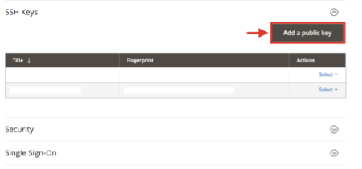

1. 貼上您在上述[!DNL Encryption Type]步驟中複製的公開金鑰。

   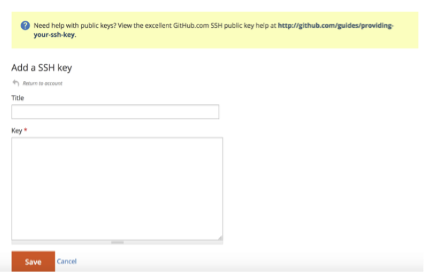

## 提供[!DNL Commerce Intelligence]個Essentials `MySQL`認證

1. 更新您的`.magento/services.yaml`。

   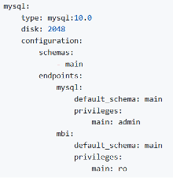

1. 更新您的`.magento.app.yaml`。

   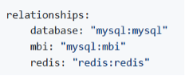

## 取得資料庫連線資訊

取得到[!DNL Commerce]資料庫的資料庫連線資訊到[!DNL Commerce Intelligence]

1. 執行下列動作以取得您的資訊。

   `echo $MAGENTO_CLOUD_RELATIONSHIPS | base64 --decode | json_pp`

1. 檢閱資料庫資訊，這些資訊應該與下列範例類似。

   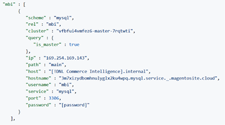

## 使用加密連線將[!DNL Commerce Intelligence]連線到您的[!DNL Commerce]資料庫

>[!NOTE]
>
>Adobe強烈建議您使用[`SSH tunnel`](../data-analyst/importing-data/integrations/mysql-via-ssh-tunnel.md)通道來建立資料庫連線。 不過，如果此方法不是選項，您仍可使用[!DNL Commerce Intelligence]將[`direct connection`](../data-analyst/importing-data/integrations/mysql-via-a-direct-connection.md)連結至您的資料庫。

在[!DNL Commerce Intelligence]畫面中輸入您的[!UICONTROL Connect your Magento Database]資訊。

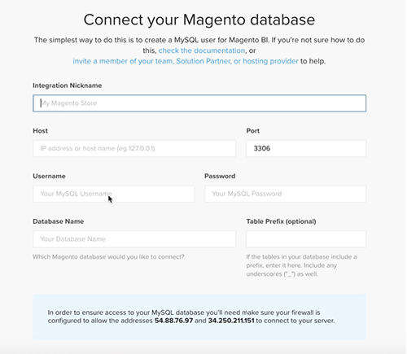

**輸入：**

[!UICONTROL Integration Name]： [為您的[!DNL Commerce Intelligence]執行個體選擇名稱]

[!UICONTROL Host]: `mbi.internal`

[!UICONTROL Port]: `3306`

[!UICONTROL 使用者名稱]: `mbi`

[!UICONTROL Password]：在上一節中顯示了[輸入密碼]

[!UICONTROL Database Name]: `main`

[!UICONTROL Table Prefixes]：如果沒有資料表首碼，[請留空]

## 設定您的&#x200B;[!UICONTROL **時區**]&#x200B;設定

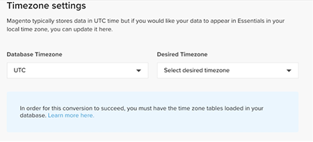

**輸入：**

[!UICONTROL Database Timezone]: `UTC`

[!UICONTROL Desired Timezone]： [選擇要顯示資料的時區]

## 取得您的加密設定資訊

專案UI會提供SSH存取字串。 此字串可用來收集&#x200B;[!UICONTROL **遠端位址**]&#x200B;和&#x200B;[!UICONTROL **使用者名稱**]&#x200B;所需的資訊。 在Project UI的「主要」分支上選取「存取網站」按鈕，以使用SSH存取字串。 然後尋找您的[!UICONTROL User Name]和[!UICONTROL Remote Address]，如下所示。

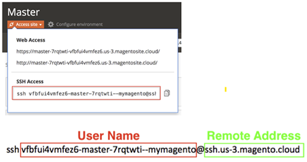

## 輸入您的[!DNL Encryption]設定

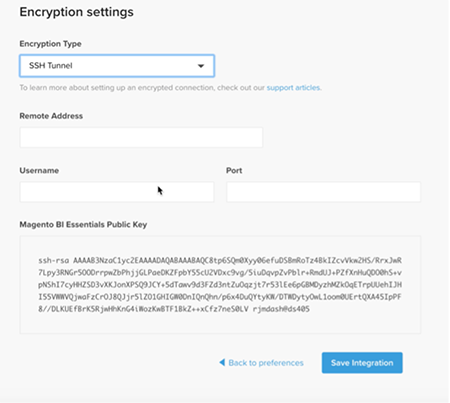

**輸入：**

[!UICONTROL Encryption Type]： `SSH Tunnel`

[!UICONTROL Remote Address]： `ssh.us-3.magento.cloud` [來自上一個步驟]

[!UICONTROL Username]： `vfbfui4vmfez6-master-7rqtwti—mymagento` [來自上一個步驟]

[!UICONTROL Port]: `22`

## 儲存您的整合。

完成設定步驟後，選取&#x200B;[!UICONTROL **儲存整合**]&#x200B;以套用變更。

您現在已成功將[!DNL Commerce]資料庫連線至[!DNL Commerce Intelligence]帳戶。

>[!NOTE]
>
>如果您是[!DNL Adobe Commerce Intelligence Pro]客戶，請聯絡您的客戶成功案例經理或客戶技術顧問，以協調後續步驟。

完成設定後，請[登入](../getting-started/sign-in.md)您的[!DNL Commerce Intelligence]帳戶。

<!---# Activate your [!DNL Commerce Intelligence] Account 

To activate [!DNL Commerce Intelligence] for on-premise or `Cloud Pro` subscriptions, [contact support](https://experienceleague.adobe.com/docs/commerce-knowledge-base/kb/troubleshooting/miscellaneous/mbi-service-policies.html).

>[!NOTE]
>
>Adobe no longer supports new `Cloud Starter` subscriptions.--->
