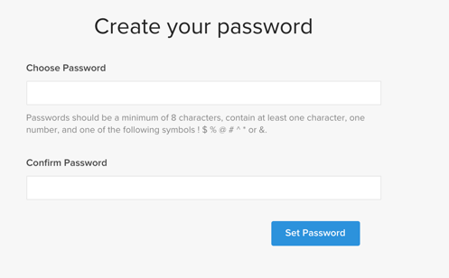

# 啟用您的 [!DNL Commerce Intelligence] 內部部署和入門訂閱帳戶

啟動 [!DNL Commerce Intelligence] 若為內部部署訂閱，請先建立 [!DNL Commerce Intelligence] 帳戶，輸入您的設定資訊，然後連線 [!DNL Commerce Intelligence] 至您的 [!DNL Commerce] 資料庫。 <!-- For information about activation in `Cloud Starter` projects, see [Activating your [!DNL Commerce Intelligence] Account for `Cloud Starter` Subscriptions](../getting-started/cloud-activation.md).-->

## 建立您的 [!DNL Commerce Intelligence] 帳戶

若要建立您的帳戶，請連絡您的Adobe帳戶團隊或客戶技術顧問。

## 建立您的密碼

建立帳戶後，請檢視您的電子郵件中是否有來自的帳戶通知電子郵件 [!DNL The Magento BI Team@rjmetrics.com]. 使用電子郵件中提供的連結來存取您的 [!DNL Commerce Intelligence] 帳戶並建立您的密碼。 移至您的收件匣並驗證您的電子郵件地址。

如果您沒有收到電子郵件， [聯絡支援人員](https://experienceleague.adobe.com/docs/commerce-knowledge-base/kb/troubleshooting/miscellaneous/mbi-service-policies.html?lang=en).

## 設定您的商店偏好設定

在設定資料庫連線之前，請先完成存放區資訊表單。 需要此資訊才能完成 **[!UICONTROL Connect your Database]** 設定。

## 新增 [!DNL Commerce Intelligence] 使用者

在您設定密碼並登入之後 [!DNL Commerce Intelligence]，您可以將其他使用者新增至 [!DNL Commerce Intelligence] 帳戶。 新增使用者時，請新增具有適當許可權的管理員使用者以完成啟用程式。

## 建立專用的 [!DNL Commerce Intelligence] 中的使用者 [!DNL Commerce] 管理員

使用 [!DNL Commerce Intelligence]，您必須將永久且專屬的使用者新增至 [!DNL Commerce] 專案。 此專用使用者會作為與的永久連線 [!DNL Commerce] ，可擷取新資料並將資料傳輸至帳戶的 [!DNL Commerce Intelligence] Data Warehouse。

設定專用的 [!DNL Commerce Intelligence] 使用者可確保不會停用或刪除該帳戶，因此會停止 [!DNL Commerce Intelligence] 連線。

>[!NOTE]
>
>Adobe鼓勵使用指出其永久狀態的帳戶名稱（例如ACI專用、ACI資料庫聯結器等）。

在您建立專用使用者之後，用於 [!DNL Commerce Intelligence] 在「管理員」中，將相同的使用者新增至 [!DNL Commerce] 專案與 **[!UICONTROL Master]** 設定 `Contributor`.

## 取得您的Commerce Intelligence SSH金鑰

1. 在 [!UICONTROL Connect your database] 第頁 —  [!DNL Commerce Intelligence] 設定，向下捲動並選取 **[!UICONTROL Encryption settings]**.

1. 的 **加密型別**，選取 `SSH Tunnel`.

1. 從下拉式清單，複製提供的公開金鑰。

   

## 將公開金鑰新增至 [!DNL Commerce Intelligence]

1. 從 [!DNL Commerce Admin]，使用下列專案的登入資訊登入： [!DNL Commerce Intelligence] 您剛才建立的使用者。

1. 選取 **帳戶設定** 標籤。

1. 向下捲動並展開 **[!UICONTROL SSH Keys]** 下拉式清單。 然後，選取 **[!UICONTROL Add a public key]**.

   

1. 將您複製的公開金鑰貼到 [!DNL Encryption Type] 以上步驟。

   

## 提供 [!DNL Commerce Intelligence] Essentials `MySQL` 認證

1. 更新您的 `.magento/services.yaml`.

   

1. 更新您的 `.magento.app.yaml`.

   

## 取得資料庫連線資訊

取得資料庫連線資訊至 [!DNL Commerce] 資料庫至 [!DNL Commerce Intelligence]

1. 執行下列動作以取得您的資訊。

   `echo $MAGENTO_CLOUD_RELATIONSHIPS | base64 --decode | json_pp`

1. 檢閱資料庫資訊，這些資訊應該與下列範例類似。

   

## 連線 [!DNL Commerce Intelligence] 至您的 [!DNL Commerce] 使用加密連線的資料庫

>[!NOTE]
>
>Adobe強烈建議您使用 [`SSH tunnel`](../data-analyst/importing-data/integrations/mysql-via-ssh-tunnel.md) 建立資料庫連線的通道。 不過，如果此方法無法提供，您仍可連結 [!DNL Commerce Intelligence] 使用至您的資料庫 [`direct connection`](../data-analyst/importing-data/integrations/mysql-via-a-direct-connection.md).

輸入您的 [!DNL Commerce Intelligence] 中的資訊 [!UICONTROL Connect your Magento Database] 畫面。

**輸入：**

[!UICONTROL Integration Name]：[為您的選擇名稱 [!DNL Commerce Intelligence] 執行個體]

[!UICONTROL Host]: `mbi.internal`

[!UICONTROL Port]: `3306`

[！UICONTROL使用者名稱]: `mbi`

[!UICONTROL Password]： [在上一節中顯示的輸入密碼]

[!UICONTROL Database Name]: `main`

[!UICONTROL Table Prefixes]： [如果沒有表格首碼，則保留空白]

## 設定您的 [!UICONTROL **時區**] 設定

**輸入：**

[!UICONTROL Database Timezone]: `UTC`

[!UICONTROL Desired Timezone]： [選擇要顯示資料的時區]

## 取得您的加密設定資訊

專案UI會提供SSH存取字串。 此字串可用來收集所需的資訊， [!UICONTROL **遠端位址**] 和 [!UICONTROL **使用者名稱**]. 在Project UI的「主要」分支上選取「存取網站」按鈕，以使用SSH存取字串。 接著，尋找您的 [!UICONTROL User Name] 和 [!UICONTROL Remote Address] 如下所示。

## 輸入您的 [!DNL Encryption] 設定

**輸入：**

[!UICONTROL Encryption Type]: `SSH Tunnel`

[!UICONTROL Remote Address]： `ssh.us-3.magento.cloud`  [上一步驟中的]

[!UICONTROL Username]： `vfbfui4vmfez6-master-7rqtwti—mymagento`  [上一步驟中的]

[!UICONTROL Port]: `22`

## 儲存您的整合。

完成設定步驟後，選取以套用變更 [!UICONTROL **儲存整合**].

您現在已成功連線 [!DNL Commerce] 資料庫至您的 [!DNL Commerce Intelligence] 帳戶。

>[!NOTE]
>
>如果您是 [!DNL Adobe Commerce Intelligence Pro] 請聯絡您的客戶成功經理或客戶技術顧問，以協調後續步驟。

完成設定後， [登入](../getting-started/sign-in.md) 至您的 [!DNL Commerce Intelligence] 帳戶。

<!---# Activate your [!DNL Commerce Intelligence] Account 

To activate [!DNL Commerce Intelligence] for on-premise or `Cloud Pro` subscriptions, [contact support](https://experienceleague.adobe.com/docs/commerce-knowledge-base/kb/troubleshooting/miscellaneous/mbi-service-policies.html).

>[!NOTE]
>
>Adobe no longer supports new `Cloud Starter` subscriptions.--->
