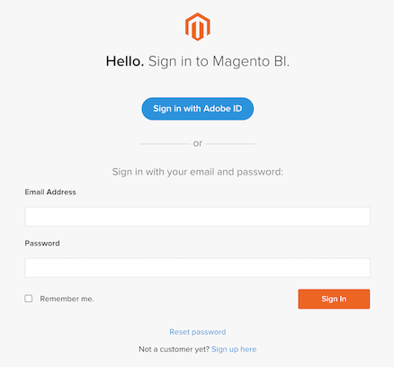
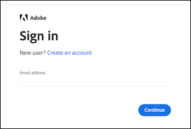

# 存取已啟用的 [!DNL MBI] 帳戶

啟動後 [!DNL MBI] 帳戶 [內部部署](../getting-started/onpremise-activation.md) 或 [雲端](../getting-started/cloud-activation.md) 並且已與您的Adobe客戶團隊合作以完成設定步驟，您現在可以登入您的帳戶。

您可以使用 [!DNL Adobe ID] 或使用 [!DNL MBI] 電子郵件地址和密碼。

## 使用 [!DNL Adobe ID]

1. 按一下 **[!UICONTROL Sign in with Adobe ID]**.

   

1. 輸入您建立 [!DNL MBI] 帳戶。 如果您尚未擁有Adobe帳戶，請按一下 **[!UICONTROL Create an account]** 並輸入您的資訊。 請記得使用您建立 [!DNL MBI] 帳戶。 電子郵件地址是您存取Adobe帳戶所需的金鑰。

>[!NOTE]
>
>如果您使用 [!DNL Adobe ID]，您無法變更 [!DNL MBI] 設定檔密碼。

## 使用您的用戶名和密碼登錄

輸入您的電子郵件地址和密碼，然後按一下 **[!UICONTROL Sign In]**.

您現在可以存取 [!DNL MBI].
