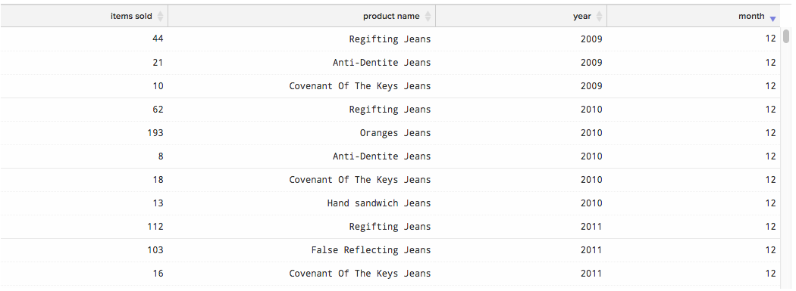
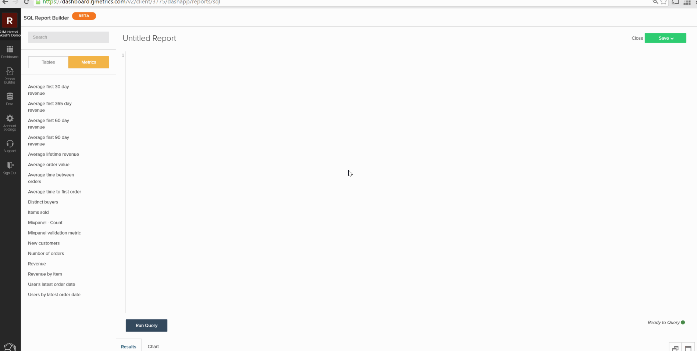

# 從SQL查詢建立視覺效果

本教學課程的目標是熟悉 `SQL Report Builder` 為你創造 `SQL visualizations`.

此 [`SQL Report Builder`](../data-analyst/dev-reports/sql-rpt-bldr.md) 是帶有下列選項的report builder:您可以執行查詢以僅檢索資料表，也可以將這些結果轉換為報告。 本教學課程說明如何從SQL查詢建立視覺效果。

## 術語

開始本教學課程之前，請參閱 `SQL Report Builder`.

- `Series`:要測量的列在SQLReport Builder中被引用為系列。 常見範例包括 `revenue`, `items sold`，和 `marketing spend`. 至少必須將一欄設為 `Series` 來建立視覺效果。

- `Category`:您要用來劃分資料的欄稱為 `Category` 這就像 `Group By` 功能 [`Visual Report Builder`](../data-user/reports/ess-rpt-build-visual.md). 例如，如果您想要依客戶的贏取來源劃分客戶期限收入，則包含贏取來源的欄將指定為 `Category`. 可以將多個欄設為 `Category`.

>[!NOTE]
>
>日期和時間戳記也可作為 `Categories`. 它們只是查詢中的另一列資料，必鬚根據需要在查詢本身中格式化和排序。

- `Labels`:這些標籤會以x軸標籤的形式套用。 分析隨時間的資料趨勢時，通常會將年和月欄指定為標籤。 可以將多列設定為「標籤」。

## 步驟1:寫入查詢

請記住下列事項：

- 此 `SQL Report Builder` uses [`Redshift SQL`](https://docs.aws.amazon.com/redshift/latest/dg/c_redshift-and-postgres-sql.html).

- 如果您要建立包含時間序列的報表，請務必 `ORDER BY` 時間戳列。 這可確保以正確順序在報表上繪製時間戳記。

- 此 `EXTRACT` 函式非常適合用來剖析時間戳記的日、周、月或年。 若 `time interval` 您想在報表上使用 `daily`, `weekly`, `monthly`，或 `yearly`.

若要開始，請開啟 `SQL Report Builder` 按一下 **[!UICONTROL Report Builder** > **SQL Report Builder]**.

例如，請考量此查詢會傳回每個產品每月銷售的項目總數：

```sql
    SELECT SUM("qty") AS "Items Sold", "products's name" AS "product name",
    EXTRACT(year from "Order date") AS "year",
    EXTRACT(month from "Order date") AS "month"
    FROM "items"
    WHERE "products's name" LIKE '%Jeans'
    GROUP BY  "products's name", "year","month"
    ORDER BY "year" ASC,"month" ASC
    LIMIT 3500
```

此查詢返回以下結果表：



## 步驟2:建立視覺效果

有了這些結果， *如何建立視覺效果？* 若要開始，請按一下 **[!UICONTROL Chart]** 標籤 `Results` 框。 這會顯示 `Chart settings` 標籤。

首次執行查詢時，報表可能看起來不可理解，因為查詢中的所有列都以系列形式繪製：


在此範例中，我們希望此圖表能呈現一段時間的趨勢。 若要建立，請使用下列設定：

- `Series`:選取 `Items sold` 欄作為 `Series` 因為我們想量一下。 定義 `Series` 欄，您會在報表中看到單一圖表。

- `Category`:在此範例中，我們想以不同行形式檢視每個產品。 為此，我們設定 `Product name` 作為 `Category`.

- `Labels`:使用欄 `year` 和 `month` 作為標籤，以便能夠檢視 `Items Sold` 隨時間變化。

>[!NOTE]
>
>查詢必須包含 `ORDER BY` 子句(如果 `date`/`time` 欄。

以下是我們如何建立此視覺效果的快速檢視，從執行查詢到設定報表皆然：



## 步驟3:選取 `Chart Type`

此範例使用 `Line` 圖表類型。 若要使用不同 `chart type`，按一下圖表選項區段上方的圖示加以變更：


## 步驟4:儲存視覺效果

如果您想再次使用此報表，請為報表命名，然後按一下 **[!UICONTROL Save]** 在右上角。

在下拉式清單中，選取 `Chart` 作為 `Type` 然後是要儲存報表的控制面板。

## 恭喜！ 你完成了。

想更進一步嗎？ 查看 [查詢最佳化最佳實務](../best-practices/optimizing-your-sql-queries.md).
