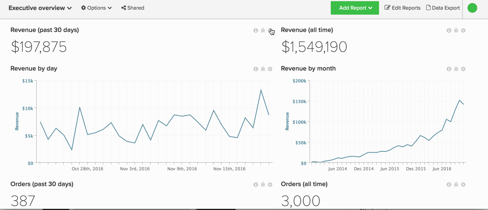
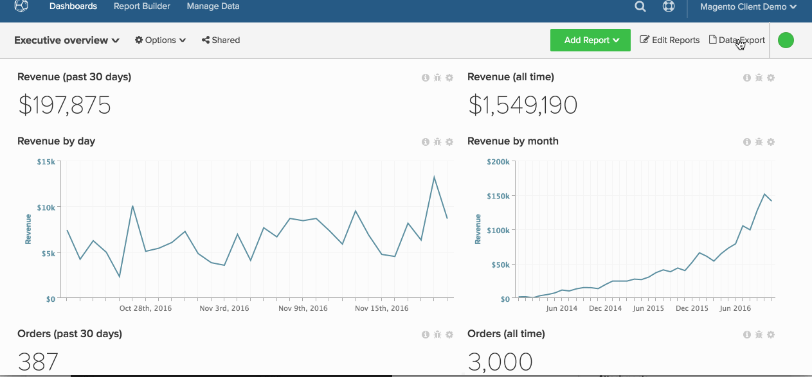

# 匯出原始資料

使用原始資料匯出，您可以匯出Data Warehouse中的記錄，以更密切地瞭解為您的儀表板提供動力的內容。 此外，原始資料匯出可協助您[精確找出資料差異](https://experienceleague.adobe.com/docs/commerce-knowledge-base/kb/troubleshooting/miscellaneous/using-data-exports-to-pinpoint-discrepancies.html)。

原始資料匯出可讓您存取透過取消標準化及預先彙總相關量度而產生的其他欄和維度。 例如，`User's first order date`是可為[!DNL Commerce Intelligence]中的每個使用者匯出的維度，但資料庫中可能無法使用。

本教學課程涵蓋下列內容：

* [選取要匯出的資料](#select)
* [正在下載匯出(](#download)
* [存取歷史匯出](#historical)

## 步驟1：選取要匯出的資料 {#select}

有兩種方式可以在[!DNL Commerce Intelligence]中匯出原始資料：

1. 在圖表層級
1. 在表格層級

### 在[!UICONTROL Manage Data]索引標籤的表格層級匯出

若要從[!UICONTROL Manage Data]索引標籤匯出資料表，您需要[管理員](../administrator/user-management/user-management.md)許可權。

1. 按一下「**[!UICONTROL Manage Data** > **&#x200B;匯出資料&#x200B;**> **原始資料匯出]**」。
1. 您會看到`Export List`最近建立的資料匯出（如果有的話）。 按一下&#x200B;**[!UICONTROL Add Export]**&#x200B;以建立匯出。
1. `New Raw Data Export`對話方塊隨即顯示。 在這裡，您可以透過選取或取消選取欄和篩選器來自訂匯出：

   * `Table` - `Table`欄位會選取資料匯出的來源。 依預設，這會顯示您導覽至的表格。
   * `Export Name` — 在此欄位中，輸入匯出的名稱。 例如： `Philadelphia - Daily Revenue`。
   * `Available Columns` — 此欄位列出資料庫中可包含在匯出中的欄（維度）。 若要新增欄，請按一下其名稱。
   * `Selected Columns` — 此欄位列出目前包含在匯出中的欄（維度）。 若要移除欄，請按一下其名稱。
   * `Filter` — 此區段列出目前套用至匯出的篩選器。 這些篩選器可以變更；也可以新增篩選器以匯出特定資料集。
   * 完成時，按一下&#x200B;**[!UICONTROL Export Data]**。

### 從控制面板在圖表層級匯出

1. 按一下任何圖表右上角的齒輪圖示。

1. 從下拉式清單中選取`Raw Export`以顯示`Raw Export`對話方塊。

1. 選擇要包含或排除的`table`、`columns`和`filters`來自訂匯出。 請參閱上一節，以取得此模組欄位的詳細資訊。

   >[!NOTE]
   >
   >依預設，`Table`欄位中顯示的表格是提供圖表支援的表格。

1. 完成時，按一下&#x200B;**[!UICONTROL Export Data]**。

在圖表層級檢視整個程式。

## 步驟2：下載匯出 {#download}

完成您在`Raw Data Export`對話方塊中的選取後，匯出將立即開始處理。 由於部分匯出內容可能較大，因此限製為1,000萬列，且可能需要一些時間才能執行。

若要檢查您的匯出是否已就緒，請按一下畫面右上角的&#x200B;**[!UICONTROL Raw Data Exports]**。 按一下&#x200B;**[!UICONTROL Download]**&#x200B;下載您匯出的壓縮`.csv`檔案。

## 步驟3：存取歷史匯出 {#historical}

若要檢視您過去的匯出專案，請按一下畫面右上角的&#x200B;**[!UICONTROL Raw Data Export]**。 待定和已完成的報表最長可存取7天。
