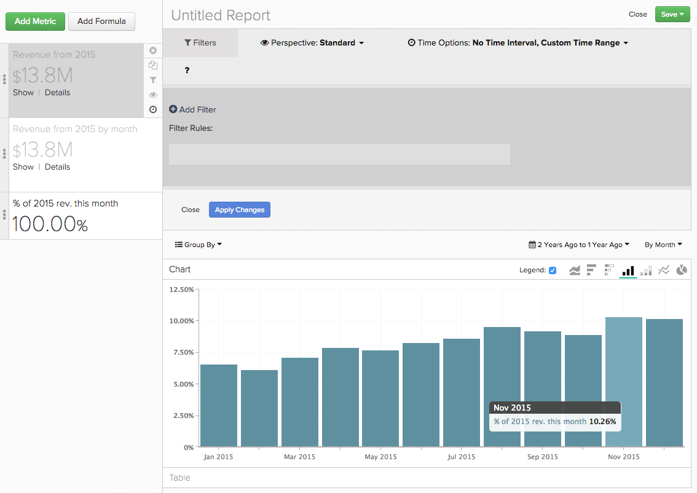
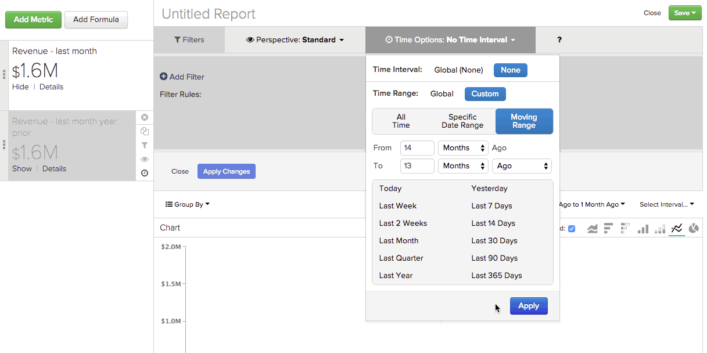
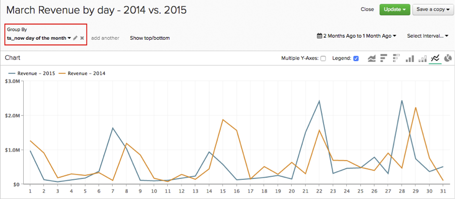
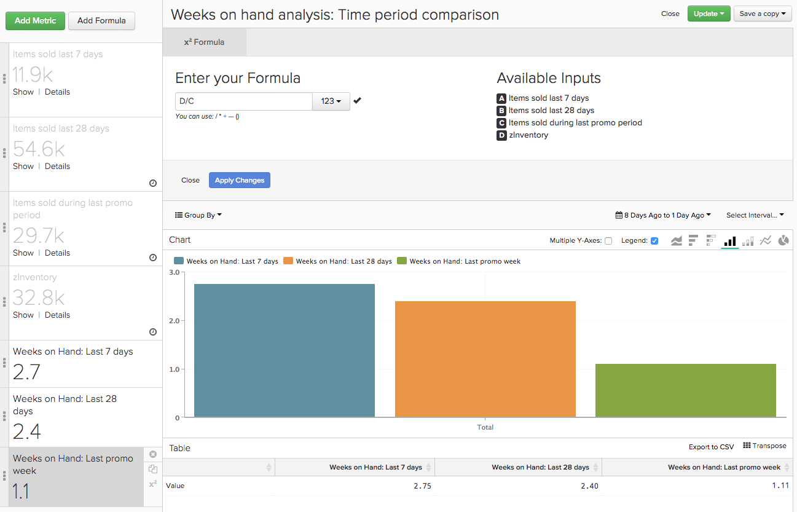

# 使用 `Time` 中的選項 `Visual Report Builder`

其中一項功能 `Visual Report Builder` 是全球 `Time Range` 和 `Interval` 設定。 這些設定可讓您分析報表中特定時段的資料。

但是，對於某些分析，您可能需要在相同的報表中考慮不同的時間範圍或時間間隔。 那就是 `Time` 有選擇。 讓你更清楚地知道如何使用 `Time` 本教學課程將涵蓋下列使用案例，供您在報表中使用：

* [分析沒有時間戳記的量度](#notimestamp)
* [為一個量度提供獨立的時間間隔](#independenttimeinterval)
* [比較不同時間範圍內的相同量度](#difftimerange)

如果您想要遵循本主題中討論的部分範例報表，請開啟 [`Visual Report Builder`](../data-user/reports/ess-rpt-build-visual.md) 中。

## 分析沒有時間戳記的量度 {#notimestamp}

有些量度無法隨著時間呈現趨勢，因為系統不會收集或儲存資料以及相關聯的時間戳記。 例如，庫存表格通常每個SKU只會包含一列。 在這種情況下，您應 [建立量度](../data-user/reports/ess-manage-data-metrics.md) 而不指定時間戳記。

在您的報表中使用此類量度時，您會發現將此量度新增至報表會自動設定獨立 `Time Interval` of `None` 和 `Time Range` of `Global`:

## 為一個量度提供獨立的時間間隔 {#independenttimeinterval}

`Time` 選項可讓您建立以時間為基礎的100%圖表，以識別在特定時間範圍內，哪個日、周、月或年貢獻的值最多。 在本節中，我們會建立圖表，顯示每年每個日曆月產生的收入百分比。

如果您想要比較年與年產生的收入，此類型的報表會很實用。 例如，如果2015年的圖表顯示1月份貢獻了該年18%的收入，而2016年的圖表只顯示了8%，那麼你就可以開始研究可能發生的情況。

1. 新增 `Revenue` 量度。
1. 按一下 **[!UICONTROL Duplicate]** 來製作量度的復本。
1. 按一下全域 **[!UICONTROL Time Range]** 選項，然後 **[!UICONTROL Moving Time Range]**. 將此設定為 `Last Year`.
1. 按一下全域 **[!UICONTROL Time Interval]** 選項，並將其設為 `Monthly`.
1. Report Builder會自動為第二個量度新增第二個Y軸。 取消選取 `Multiple Y-Axes` 框。
1. 接下來，我們申請一個 `Time Interval` 至第一個量度。 按一下 **[!UICONTROL Time Options]** （時鐘圖示） `first Revenue metric`.
1. 按一下 **[!UICONTROL Time Options]** 在報表上方顯示的展開視窗中。
1. 在下拉式清單中，設定下列項目：

   * `Time Interval`:將此項設定為 `None`.

   * `Time Range`:將此項設定為 `Last Year` 按一下 **[!UICONTROL Custom]**，然後 **[!UICONTROL Moving Range]**，最後選取 `Last Year` 選項。

   * 按一下 **[!UICONTROL Apply]** 以儲存間隔和範圍設定。 這會建立一個量度來計算前一年的總收入。 接下來，我們將此量度作為公式中的分母。

   * 若要查看每個月的收入百分比，我們需要新增公式至報表。 按一下 **[!UICONTROL Add Formula]**.

   * 輸入 `B/A` 在「公式」欄位中，然後選取 `% Percent` 從文字欄位旁的下拉式清單中。 此公式會將去年特定月份的收入金額除以去年的收入總額。

   * 按一下 **[!UICONTROL Apply Changes]**.

   * 隱藏兩個輸入量度，並重新命名公式。

現在，我們可以看到去年每月的影響力：

## 比較不同時間範圍內的相同量度 {#difftimerange}

此範例使用自訂維度，稱為 `Day number of the month`. 如果您想建立此報表，但您的Data Warehouse中尚未包含此維度， [聯絡支援](../guide-overview.md) 以求協助。

此類別中最常見的兩個範例是：(1)比較增長量度（逐年比較或月對月），以及(2)更清楚了解最近的庫存或項目銷售趨勢。

為了展示此使用案例，我們檢視上個月的每日收入與上年同期相比。 假設我們想查看2016年1月的每日收入，然後將其與2015年1月、2014年1月等等進行比較 — 此報告將向我們展示這一點。

1. 新增 `Revenue` 量度。
1. 按一下 **[!UICONTROL Duplicate]** 來製作量度的復本。
1. 將第一個量度重新命名為 `Items sold last 7 days` 第二個量度設為 `Items sold last 28 days`.
1. 按一下 **[!UICONTROL Time Range]**，然後 **[!UICONTROL Moving Time Range]**. 將此設定為 `Last Month`.
1. 按一下 **[!UICONTROL Time Interval]** 並將其設定為 `None`.
1. 按一下 **[!UICONTROL Time Options]** （時鐘錶徵圖） `Revenue` 量度。
1. 按一下 **[!UICONTROL Time Options]** 在報表上方顯示的展開視窗中。
1. 在下拉式清單中，設定下列項目：

   * `Time Interval`:將此項設定為 `None`.

   * `Time Range`:將此項設定為 `From 14 Months Ago To 13 Months Ago` 按一下 **[!UICONTROL Custom]** then **[!UICONTROL Moving Range]**. 使用功能表頂端的欄位和下拉式清單來設定範圍。 此設定可讓我們查看前一個月（但前一年）的收入。
   不要擔心量度是否從報表中消失，設定獨立時間選項會自動從報表中隱藏量度。 若要重新顯示，請按一下 **[!UICONTROL Show]** 在量度旁。

   

   * 按一下 **[!UICONTROL Apply]** 以儲存間隔和範圍設定。

   * 接下來，我們新增自訂 `Day number of the month` 維度，按一下 **[!UICONTROL Group By]** 和選取維度。 這會傳回訂單月份的天數，例如，在3月2日下的訂單會傳回 `2`.

   * 在 `Group By` 下拉式清單，選取 `Show All` 按一下 **[!UICONTROL Apply]**. 這將有效建立報表的X軸值：

   

   * 重新命名量度。 在範例中，第一個量度是 `Revenue - 2015` 第二個是 `Revenue - 2014`.

自訂的其他常見用途 `Time Options` 是確定供應周數。 尤其是在節假日季或特別促銷期間，您可能會想要考慮在上週、月份和先前促銷期間售出的商品，以做出明智的購買決策。

請記得將時間範圍設為您自行建立此報表時所需的時間。

1. 新增 `Items Sold` 量度。
1. 按一下 **[!UICONTROL Duplicate]** 來製作量度的復本。
1. 重新命名量度。 您可以使用與我們相同的名稱，或使用類似的名稱：
   1. 將第一個量度重新命名為 `Items sold last 7 days`.
   1. 將第二個量度重新命名為 `Items sold last 28 days`.
1. 在 `Items sold last 7 days` 量度，按一下全域 **[!UICONTROL Time Range]** 選項，然後 **[!UICONTROL Moving Time Range]**. 在此範例中，我們將其設為 `Last 7 Days`.
1. 按一下 **[!UICONTROL Time Interval]** 並將其設定為 `None`.
1. 接下來，我們定義 `Time Options` 針對 `Items sold last 28 days` 量度。 按一下 **[!UICONTROL Time Options]** （時鐘圖示） `second Items sold` 量度。
1. 按一下 **[!UICONTROL Time Options]** 在報表上方顯示的展開視窗中。
1. 在下拉式清單中，設定下列項目：

   * `Time Interval`:將此項設定為 `None`.
   * `Time Range`:將此項設定為 `From 29 days to 1 day ago` 按一下 **[!UICONTROL Custom]**，然後 **[!UICONTROL Moving Range]**. 使用功能表頂端的欄位和下拉式清單來設定範圍。
   * 按一下 **[!UICONTROL Apply]** 以儲存間隔和範圍設定。
   * 複製 `Items sold last 28 days` 量度並開啟新量度的 `Time Options`. 將選項設為：

      * `Time Interval`:保留此 `None`.
      * `Time Range`:按一下「 」，將此項目變更為符合您感興趣的促銷活動的日期範圍 **[!UICONTROL Specific Date Range]** 然後輸入相應的日期。
      * 重新命名量度 `Items sold during last promotion` 或類似的。
      * 新增 `Units on hand` 量度。
      * 接下來，我們需要添加計算，以顯示該時段(`last 7 days`, `last 28 days`，和 `last promo` 期間)，我們會納入報告。 每個時段需要執行一次。

要建立公式，請按一下 **[!UICONTROL Add Formula]**. 輸入下面的公式，然後按一下 **[!UICONTROL Apply Changes]** 完成時。 對以下三個時段中的每個時段重複此步驟：

* 若 `last 7 days time period`，輸入 `D / A` 在 `Formula` 欄位。
* 若 `last 28 days time period`，輸入 `D / (B/4)` 在 `Formula` 欄位。

   >[!NOTE]
   >
   >請務必在此將您選取的時間範圍正規化。 在此範例中，28天應分為4週。 您可能需要對公式套用不同的邏輯。

* 若 `last promo period`，輸入 `D / C` 在 `Formula` 欄位。

   

* 最後，透過隱藏量度並新增 `SKU` 或與報表類似的維度 `Group By`.

此範例說明，在整個產品14天的銷售中，目前的庫存水準已經完全適合。 但是，增加一個可比的促銷期意味著公司需要做出一些改變 — 要麼訂購更多庫存，要麼只推銷庫存量足夠的商品。

由於客戶的行為隨著時間而有所不同，因此在執行分析時可能會發現資料差異。 設定自訂時間選項可讓您快速建立複雜的分析，讓資料驅動的決策能夠影響歷史趨勢。

查看我們的 [訓練影片](https://support.magento.com/hc/en-us/articles/360016730071-Training-Video-Time-Options-in-the-Visual-Report-Builder) 了解更多。
