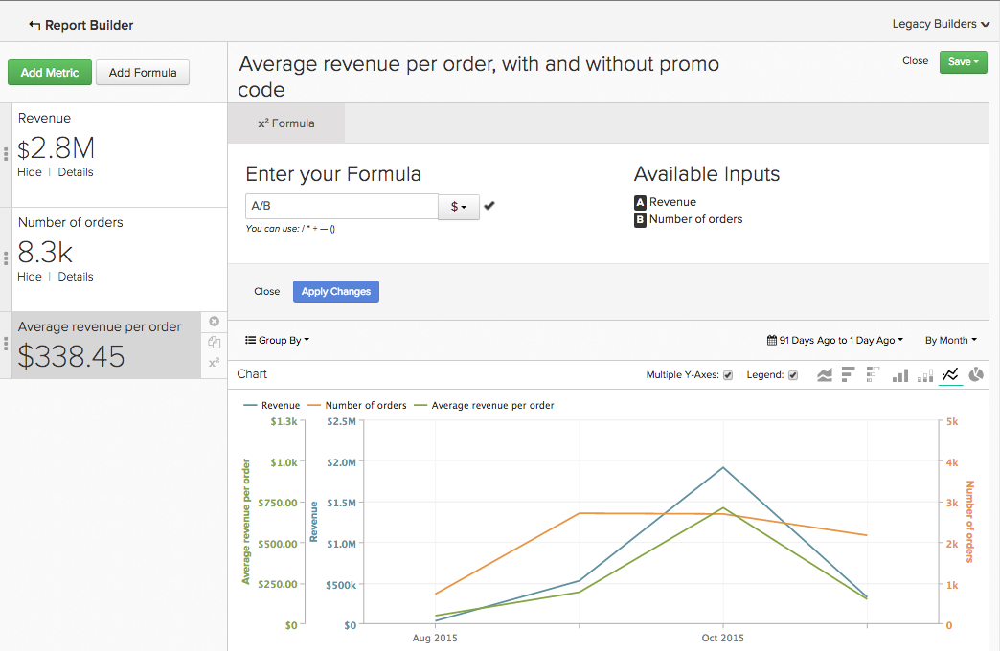
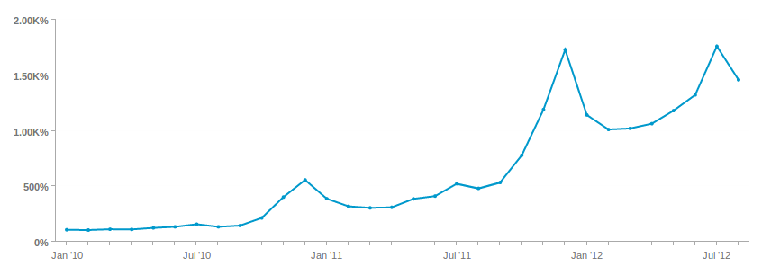

# 使用[!DNL Visual Report Builder]

[[!DNL Visual Report Builder]](../data-user/reports/ess-rpt-build-visual.md)可讓您透過視覺化方式探索資料，以取得深入見解並協助推動業務決策。 本教學課程將逐步引導您完成建立基本報表的程式。

>[!NOTE]
>
>若要將報告新增到儀表板，您需要`Standard` [使用者許可權](../administrator/user-management/user-management.md)以及`Edit`儀表板的存取權。

## 步驟1：建立報表

若要開始建立報告，請按一下側邊欄上的&#x200B;**[!UICONTROL Report Builder]**&#x200B;或任何儀表板頂端的&#x200B;**[!UICONTROL Add Report]**。 顯示`Report Builder`頁面時，按一下&#x200B;**[!UICONTROL Visual Report Builder]**&#x200B;選項。

若要編輯在[!DNL Visual Report Builder]中建立的報表，請按一下任何圖表右上角的齒輪（[選項]）圖示，然後按一下&#x200B;**[!UICONTROL Edit]**。

## 步驟2：新增量度

建立分析的第一個步驟是選取[要分析的量度](../data-user/reports/ess-manage-data-metrics.md)。 雖然量度預設會依字母順序列出，但您也可以依提供量度的表格將其分組。

在選取初始量度後，您可以新增其他量度，並將所有量度覆蓋在單一報表上，或透過新增公式來執行多量度計算。

## 步驟3：新增`Formulas`

按一下位於報表中量度清單正上方的`Formulas`，即可將&#x200B;**[!UICONTROL Add Formula]**&#x200B;新增至報表。 在[公式編輯器](../data-analyst/dev-reports/formulas-in-rpt-bldr.md)中，報表中包含的任何量度都可當作輸入使用。 基本的數學運運算元可用來控制不同的量度。

假設您想要建立報表，顯示每筆訂單的平均收入。 在此情況下，您會將`Revenue`量度除以`Number of orders`量度。

## 步驟4：設定`Time Period`和`Interval of Analysis` {#time}

若要聚焦於特定時間段，您可以設定分析的時段。 您也可以選擇時間間隔來區隔資料（例如，按年、按季度或按月）。 使用圖表右上角的功能表來設定時段和間隔。

設定時段的特定日期範圍時，請確定開始日期是間隔的開始，結束日期是間隔的結束。

例如，設定從`January 1st`到`March 1st`的時間段並選擇`monthly`間隔會將`March`顯示為資料點，但忽略`March`中除了`March 1`之外的每一天。 在這種情況下，您應該從`Time Period`製作您的`January 1 to March 31`。

## 步驟5： `Group by` / `Segmenting the Analysis` {#groupby}

[若要依資料維度](../best-practices/segment-filter.md)來劃分量度，請按一下圖表左上方的&#x200B;**[!UICONTROL Group by]**&#x200B;功能表。 這會顯示一個下拉式清單，其中包含清單中包含的第一個量度所有可用的維度。

您可以選擇`None`以防止量度分段。 例如，您可能想要傳回總收入的量度而不分段，同時讓另一個收入量度依地區分段。

返回每個訂單範例的平均收入，並將「群組依據」設定為促銷代碼。 這顯示有促銷代碼和無促銷代碼的訂單的每份訂單平均收入。

如果分析中包含的量度是建立在不同資料表格上，快顯視窗可讓您選取每個表格中相符的資料維度。 此處的目標是尋找共用分段值型別的維度：

## 步驟6：設定`Metric Filters`、`Perspective`和`Time Interval` {#metric-specific}

對於新增至分析的每個量度，您可以新增篩選器、選取相關的資料透視，以及設定`time interval`選項。 若要存取這些功能，請按一下報告中所包含量度旁的funnel (`Filter`)、眼睛(`Perspective`)和時鐘(`Time`)圖示。

### `Filters`

`Filters`限制分析中包含的資料集。 例如，在評估個別贏取管道及移除極端值時，篩選器就相當實用。

除了下拉式功能表和文字方塊之外，您也可以使用特殊篩選運運算元（例如`LIKE`或`IN`）來建立篩選器。

支援使用萬用字元（`%`或`_`）搭配`LIKE`陳述式。 `%`萬用字元符合多個字元，而`_`只符合任何單一字元。 例如：

- `affiliate's name Like B%`僅允許來自名稱以`B`開頭的客戶的資料。

- `affiliate's name Like _ake`僅允許來自名稱類似`Jake`、`Rake`或`Bake`之客戶的資料，但不允許`Drake`或`Blake`的資料。

新增多個篩選器可讓您嚴格控制圖表的資料。 依預設，所有篩選條件都必須為true，才會包含資料片段，但您可以編輯「篩選規則」文字方塊來建立OR關係。

### `Perspectives`

`Perspectives`讓您輕鬆切換資料的不同檢視。 檢視可用功能：

- `Standard perspective`：標準透視在x軸上顯示相符日期的結果（例如1月的收入）。 這是您在「每筆訂單的平均收入」範例中使用的角度。

- `Amount`或`Percent Change`與`Previous Period`的比較：此觀點顯示從一個間隔到下一個間隔的量或百分比變更，可用來測量快速變更量度的變更率。 這裡還有一個視角來比較間隔與去年同一時段，以顯示年與年的成長率。

- `Cumulative perspective`： `cumulative perspective`會顯示該時段內量度的進行中或累計總和。 這通常用於分析客戶總數及規劃未來容量。

- `Percent of First Value perspective`：此透視以分析中包含的首次時間間隔的百分比顯示資料。 這對於測量特定動作相對於第一個週期績效的有效性很有幫助。

- `Rolling averages window perspective`：滾動平均視窗透視會顯示指定時間範圍內量度的滾動平均值。 間隔必須與報告層級上設定的間隔相同。 例如，如果報表依周顯示收入的最後一個完整季度，您可以將滾動平均視窗時間範圍設定為四周。 這表示前三個值為Null，而第四個值代表前四週收入的平均值。 為清楚起見，如果您以滾動平均檢視相同的量度，如下列範例所示，請務必關閉`Multiple Y-Axes`核取方塊。

### 量度特定時間選項

報表中使用的量度有兩個選項：它們可根據全域時間選項或不根據將它們顯示為純量數字的時間趨勢。

將量度時間間隔變更為`None`會傳回`scalar`個數字，當建立的公式包含將時間趨勢量度除以`scalar`個數字時，此數值非常有用。 您也可以將`scalar`量度的時間範圍變更為與報表的時間範圍無關的時間範圍。

舉例來說，假設您想瞭解2019年每月收入在2019年整體收入中所佔的百分比。 您可以在全域時間範圍為2019年1月1日至2019年12月31日的報表中新增兩個`Revenue`量度，並以每月間隔分段。

>[!NOTE]
>
>如果您新增`group by`維度，請選擇新的視覺效果，或調整時間間隔，然後只儲存數字(`scalar`)。 當您下次從儀表板開啟該報表時，不會保留這些調整，只會保留時間範圍。

若要進一步瞭解如何在報表中使用時間選項，請參閱此[教學課程](../tutorials/time-options-visual-rpt-bldr.md)。

## 步驟7：儲存報表

建立圖表時，按一下&#x200B;**[!UICONTROL Save]**&#x200B;右上角的`Visual Report Builder`即可儲存圖表。

您可選擇使用`scalar`下拉式清單儲存圖表、表格或數字(`Type`)，以及使用`Location`下拉式清單儲存報告的儀表板。

然後，您可以按一下「**[!UICONTROL Save to Dashboard]**」以儲存報表。

## 報表輸出

若要協助您決定要選擇哪個報表輸出，請參閱下列內容：

### 圖表

### 表格

### 數字(`scalar`)

恭喜！您已完成。
