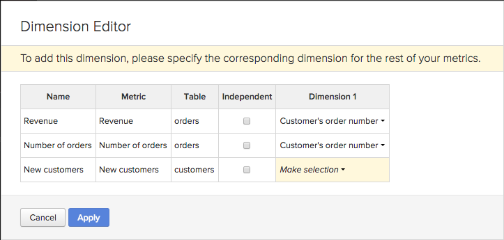

# 使用 `Visual Report Builder`

此 [`Visual Report Builder`](../data-user/reports/ess-rpt-build-visual.md) 可讓您透過視覺化方式探索資料，以吸引深入分析，並協助推動業務決策。 本教學課程會逐步帶您了解建立基本報表的程式。

>[!NOTE]
>
>若要新增報表至控制面板，您需要 `Standard` [使用者權限](../administrator/user-management/user-management.md) 和 `Edit` 存取控制面板。

## 步驟1:建立報表

若要開始建立新報表，請按一下 **[!UICONTROL Report Builder]** 在邊欄或 **[!UICONTROL Add Report]** 在任何控制面板的頂端。 當 `Report Builder` 選擇頁面，按一下 **[!UICONTROL Visual Report Builder]** 選項。

若要編輯在 `Visual Report Builder`，按一下任何圖表右上角的齒輪（選項）圖示，然後按一下 **[!UICONTROL Edit]**.

## 步驟2:新增量度

建立分析的第一步是選取 [量度](../data-user/reports/ess-manage-data-metrics.md) 來分析。 雖然量度依預設按字母順序列出，您也可以依據提供量度的表格加以分組。

您可以在選取初始量度後新增其他量度，並將所有量度覆蓋在單一報表上，或透過新增公式執行多量度計算。

## 步驟3:新增 `Formulas`

`Formulas` 按一下 **[!UICONTROL Add Formula]**，位於報表量度清單的上方。 在 [公式編輯器](../data-analyst/dev-reports/formulas-in-rpt-bldr.md)，報表中包含的任何量度都可作為輸入。 基本數學運算子可用來控制不同的量度。

假設我們想要建立報表，顯示每筆訂單的平均收入。 在這種情況下，我們將 `Revenue` 量度 `Number of orders` 量度。

## 步驟4:設定 `Time Period` 和 `Interval of Analysis` {#time}

若要鎖定在特定時間段，您可以設定分析的時段。 您也可以選擇時間間隔來劃分資料（例如，依年、依季或依月）。 使用圖表右上角的功能表來設定時段和間隔。

為時段設定特定日期範圍時，請確定開始日期在間隔的開頭，而結束日期在間隔的結尾。

例如，設定 `January 1st to March 1st` 選擇 `monthly` 間隔將顯示 `March` 作為資料點，但每天忽略 `March` expert `March 1`. 在這種情況下，您應將 `Time Period` 從 `January 1 to March 31`.

## 步驟5: `Group by` / `Segmenting the Analysis` {#groupby}

[若要依資料維度劃分量度](../best-practices/segment-filter.md)，按一下 **[!UICONTROL Group by]** 菜單。 這會顯示下拉式清單，其中包含清單中第一個量度的所有可用維度。

您可以選擇 `None` 來防止量度分段。 例如，您可能希望某個量度可傳回總收入而不進行分段，而另一個收入量度則依地區分段。

返回我們的每筆訂單平均收入範例，並將群組設為促銷代碼。 這會顯示有和沒有促銷代碼的訂單的每筆訂單平均收入。

如果分析中包含的量度是建立在不同的資料表格上，則會出現快顯視窗，讓您在每個表格中選取相符的資料維度。 此處的目標是尋找共用相同類型區段值的維度：

## 步驟6:設定 `Metric Filters`, `Perspective`，和 `Time Interval` {#metric-specific}

您可以針對新增至分析的每個量度新增篩選器、選取相關資料透視，然後設定 `time interval` 選項。 若要存取這些功能，請按一下漏斗(`Filter`)，眼睛(`Perspective`)和時鐘(`Time`)圖示（位於報表所含量度旁）。

### `Filters`

`Filters` 限制分析中包含的資料集。 例如，在評估個別贏取通道並移除離群值時，篩選器非常有用。

除了下拉式功能表和文字方塊外，您也可以使用特殊的篩選運算子，例如 `LIKE` 或 `IN` 來建立篩選器。

萬用字元(`%` 或 `_`)結合 `LIKE` 支援陳述式。 此 `%` 萬用字元將匹配多個字元，而 `_` 只符合任何單一字元。 例如：

- `affiliate's name Like B%` 僅允許名稱開頭為的客戶的資料 `B`.

- `affiliate's name Like _ake` 僅允許來自名稱類似 `Jake`, `Rake`，或 `Bake` 但 `Drake` 或 `Blake`.

新增多個篩選器可讓您嚴格控製圖表的資料。 預設情況下，要包含某段資料的所有篩選條件都必須為true，但您可以通過編輯「篩選規則」文本框來建立OR關係。

### `Perspectives`

`Perspectives` 可讓您輕鬆切換資料的不同檢視。 讓我們查看可用項目：

- `Standard perspective`:標準透視會在x軸上顯示相符日期的結果（例如一月的收入）。 這是我們在「每筆訂單平均收入」範例中使用的觀點。

- `Amount` 或 `Percent Change` vers `Previous Period` 觀點：此透視顯示從一個時間間隔到下一個時間間隔的數量或百分比變化，並且對於測量快速變化度量中的變化率非常有用。還有一個透視將間隔與去年的同一時間段進行比較，以顯示逐年增長。

- `Cumulative perspective`:此 `cumulative perspective` 顯示該時段內量度的持續或累計總和量。 這通常用於分析總客戶和規劃未來容量。

- `Percent of First Value perspective`:此觀點會以分析中包含之第一個時間間隔的百分比顯示資料。 這有助於衡量特定行動相對於第一期績效的成效。

- `Rolling averages window perspective`:「滾動平均值」窗口透視顯示指定時間範圍內的度量的滾動平均值。 間隔必須與報表層級上設定的間隔相同。 例如，如果報表依周顯示收入的最後一個完整季度，您可以將滾動平均視窗時間範圍設定為4週，而前三個值將為null，而第四個值代表收入前4週的平均值。 為清楚起見，請務必關閉 `Multiple Y-Axes` 核取方塊（如以下範例中）。

### 量度特定時間選項

報表中所用量度有兩個選項：它們可以根據全局時間選項（或不根據全局時間選項）隨時間的趨勢，這些選項將顯示為標量數。

將量度時間間隔變更為 `None` 傳回a `scalar` 數字，當建立涉及將時間趨勢量度除以 `scalar` 數字。 此外，您也可以變更 `scalar` 量度至與報表無關的時間範圍。

例如，我們希望將2019年月收入以佔2019年總收入的百分比表示。 我們可以加兩個 `Revenue` 量度，其全域時間範圍為2019年1月1日至2019年12月31日，依每月間隔分段。

>[!NOTE]
>
>如果您新增 `group by` 維度，選擇新的視覺效果，或調整時間間隔，然後只儲存數字(`scalar`)，則這些調整不會在您下次從控制面板開啟該報表時保留，只會保留時間範圍。

若要進一步了解在報表中使用時間選項，請參閱 [教學課程](../tutorials/time-options-visual-rpt-bldr.md).

## 步驟7:儲存報表

建立新圖表時，可按一下 **[!UICONTROL Save]** 在 `Visual Report Builder`.

您可以選擇保存圖表、表或數字(`scalar`)使用 `Type` 下拉式清單和應使用 `Location` 下拉式清單。

接著，按一下「 **[!UICONTROL Save to Dashboard]**.

## 報表輸出

若要協助您決定要選擇哪個報表輸出，請參閱下列內容：

### 圖表

### 表格

### 數字(`scalar`)

恭喜！ 你完了。
